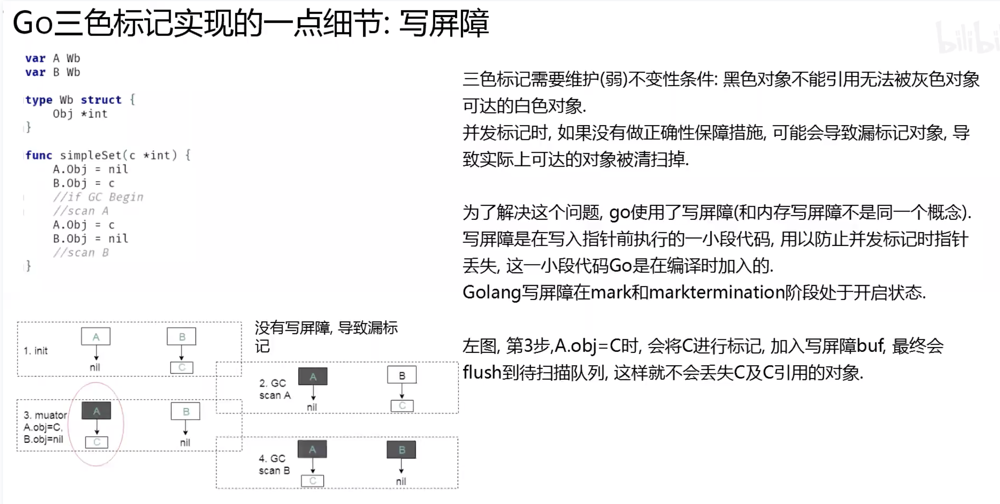
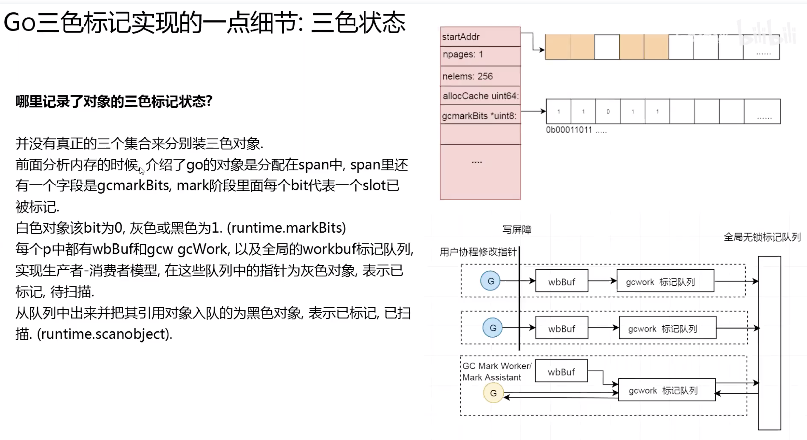
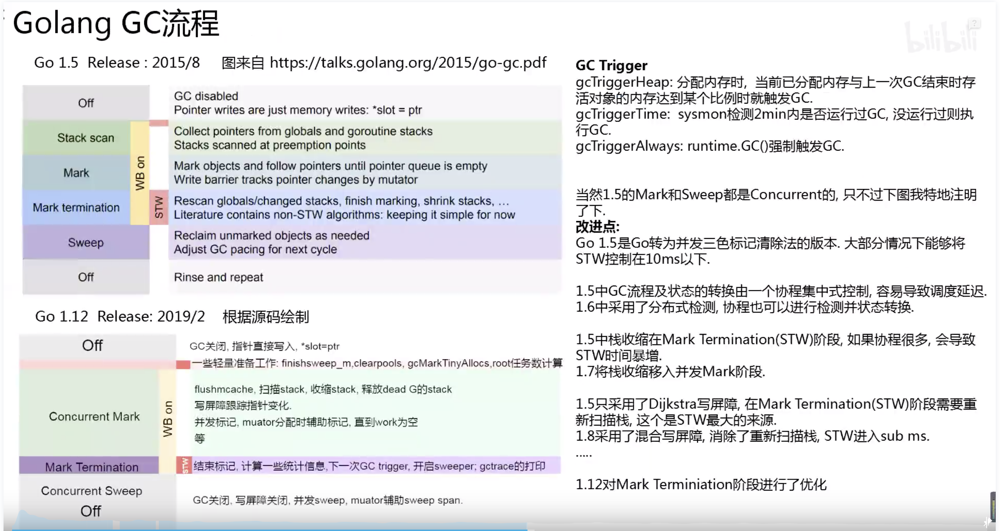
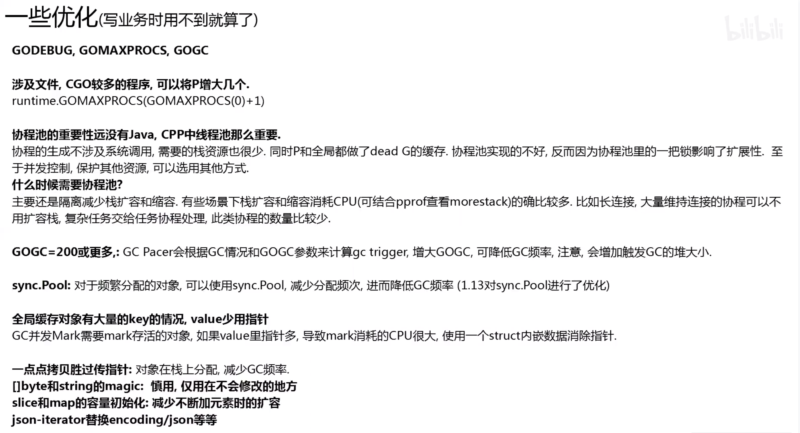
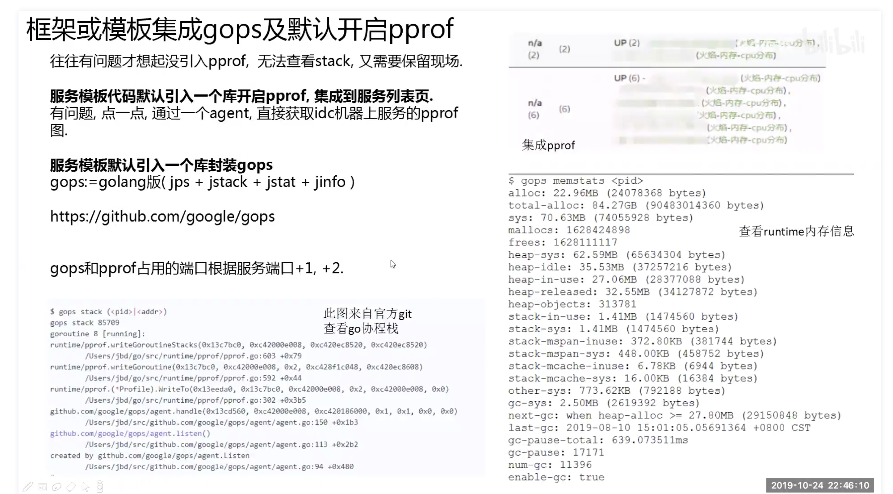
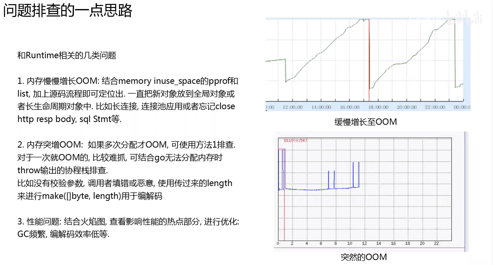
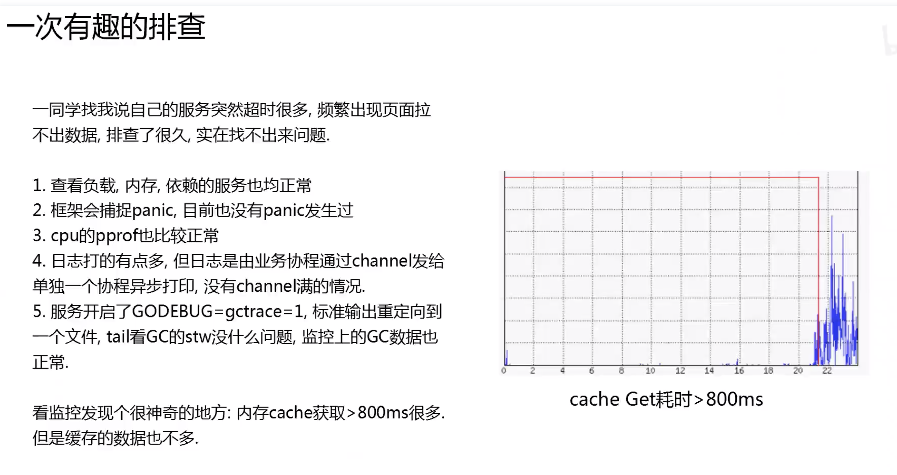
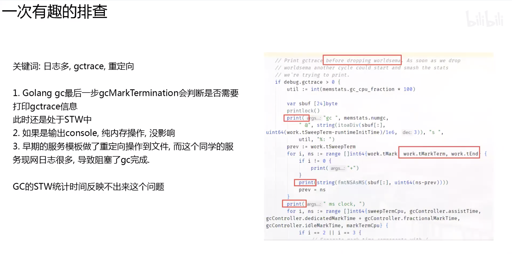

## Go gc


### 1. 三色标记

1. 有黑白灰三个集合，初始时所有对象都是白色  
2. 从 Root 对象开始标记，将所有可达对象标记为灰色  
3. 从灰色对象集合取出对象，将其引用的对象标记为灰色，放入灰色集合，并将自己标记黑色  
4. 重复第三步，直到灰色集合为空，即所有可达对象都被标记  
5. 标记结束后，不可达的白色对象即为垃圾，对内存进行迭代清扫，回收白色对象  
6. 重置 GC 状态  


go 和 java 不同，go 的对象在内存中并没有 header

1. 标记和程序并发，会漏标记对象吗？如何解决的？  
2. 哪里记录了对象的三色标记状态？  
3. 标记时，拿到一个指针，怎么知道它是哪个对象？也许是某个对象的内部指针？
这个对象的内存哪些地方代表了它引用的对象呢？  

### 2. 三色标记实现的一点细节

#### 2.1 写屏障



> 上图来源：Go 夜读

- 三色标记需要维护（弱）不变形条件；黑色对象不能引用无法被灰色对象可达的白色对象

- 并发标记时，如果没有做正确性的保障措施，可能会导致漏标记对象，导致实际上可达的对象被请扫掉

为了解决这个问题，go 使用了写屏障（和内存写屏障不是同一个概念）。写屏障是在写入指针前执行的一小段代码，用以防止并发标记时指针丢失，
这一小段代码，Go 是在编译时加入的。

Golang 写屏障在 mark 和 marktermination 阶段处于开启状态

图中，当第三步，A.obj = C 时，会将 C 进行标记。加入写屏障 bug，最终会 flush 到待扫描队列，这样就不会丢失 C 及 C引用对象。

栈中指针 slot 的操作没有写屏障

- Dijkstra 写屏障是对被写入的指针进行 grey 操作，不能防止指针从 heap 被隐藏到黑色的栈中，需要 STW 重新扫描栈。  
- Yuasa 写屏障是对将被覆盖的指针进行 grey 操作，不能防止指针从栈被隐藏到黑色的 heap 对象中，需要在 GC 开始时保存栈的快照。  

go 1.8写屏障混合了两者，既不需要 GC 开始时保存栈快照，也不需要 STW 重新扫描栈，原型如下：

```go
writePointer(slot, ptr):
    shade(*slot)
    if current statck is grey:
        shade(ptr)
    *slot = ptr
```

#### 2.2 三色状态



> 上图来源：Go 夜读

并没有真正的三个集合类分别装三色对象。

前面分析内存的时候，介绍了 go 的对象是分配在 span 中，spna 里还有一个字段是 gcmarkBits，mark 阶段
里面每个 bit 代表一个 slot 已被标记。

白色对象该 bit 为 0，灰色或黑色为 1 （runtime.markBits）

每个 p 中都有 wbBuff 和 gcw gcWork，以及全局的 workbuf 标记队列，实现 生产者-消费者模型，
在这些队列中的指针为灰色对象，表示已标记，待扫描

从队列中出来并把其引用对象入队的为黑色对象，表示已标记，已扫描（runtime.scanobject）


#### 2.3 扫描与元信息


> 上图来源：Go 夜读


### 3. Golang Gc 流程



> 上图来源：Go 夜读


### 4. 未涉及的点

- 栈分配  
- fixalloc, tinyalloc  
- 逃逸分析  
- 内存归还  
- 清扫与辅助清扫  
- go gc mark 任务分配  
- 辅助标记  
- revise  
- mark termination 流程  
- GC pacer, trigger 计算，goal 计算   


### 5. 实践

通过 godoc 来开启一个 go 进程，用 ab 来调用，加上 debug trace 观察其状态

GOMAXPROCS=8 GODEBUG=schedtrace=500 godoc -http=:6060 (加上 scheddetail=1观察更详细信息)

ab -c 1000 -n 100000 'http://localhost:6060/'

这是一个服务通过调用 debug.SetGCPercent 设置 GOGC，分别是 100,500,1650 时的表现
GOGC 越大，GC频次月底。但是触发GC的堆内存也越大


### 6. 一些优化

> 图来源：Go 夜读
















### 感谢

- [Go 夜读](https://github.com/talkgo/night)


