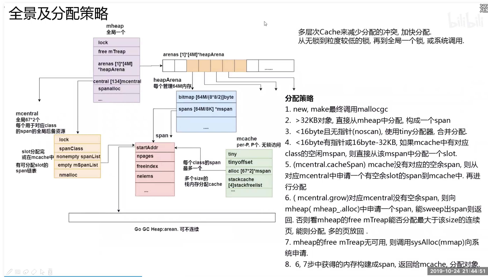

## Go 内存管理

Go 内存局域 TcMalloc，使用连续虚拟地址，以页（8k）为单位、多级缓存进行管理；在分配内存时，
需要对size 进行对齐处理，根据 best-fit 找到合适的 mspan，对未用完的内存还会拆分成其他大小的 mspan 继续使用。

在 new 一个 object 时（忽略逃逸分析），根据 object 的 size 做不同的分配策略：

- 极小对象（size < 16 byte）直接在当前 P 的 mcache 上的 tiny 缓存上分配；

- 小对象（16 byte <= size <= 32 k）在当前 P 的 mcache 上对应 slot 的空闲列表中分配，
无空闲列表则会继续向 mcentral 申请（还是没有则向 mheap 申请）；

- 大对象（size > 32k） 直接通过 mheap 申请

内存分配关键点

* 分配速度问题
    * 先本地cache，后全局
* 碎片率问题
    * mspan go里一个 page(8KB)

#### 分配策略

> 上图来源：Go 夜读

1. new, make 最终调用 mallocgc   
2. 大于 32KB 对象，直接从 mheap 中分配，构成一个 span   
3. 小于 16byte 且无指针(noscan)，使用 tiny分配器，合并分配   
4. 小于 16byte 有指针或16byte-32KB，如果 mcache 中有对应 class 的空闲 mspan，则直接从该 mspan 中分配一个 slot.   
5. (mcentral.cacheSpan) mcache 没有对应的空余 span，则从对应 mcentral 中申请一个有空余 slot 的 span 到 mcache 中，再进行分配   
6. (mcentral.grow) 对应 mcentral 没有空余 span，则向 mheap（mheap_.alloc）中申请一个 span，能 sweep 出 span 则返回。否则看 mheap 的 free mTreap 能否分配
大于该 size 的连续页，能则分配，多的页放回。  
7. mheap 的 free mTreap 无可用，则调用 sysAlloc（mmap）向系统申请  
8. 6、7步中获得的内存构建成 span，返回给 mcache，分配对象。  

#### 1. 内存分配知识

#### 2. 动态存储分配器

#### 3. mmap 函数

Unix 进程可以使用 mmap 函数来创建新的虚拟存储区域并将对象映射到这些区域中。

mmap 函数要求内核创建一个新的虚拟存储区域，最好是从起始地址 start 开始的一个区域，并将文件描述符
fd指定的对象的一个连续的片（chunk）映射到新的区域。

#### 4. 数据频繁分配与回收

对于有效地进行数据频繁分配与回收，减少碎片，一般有两种手段：

- 空闲链表：提供直接可供使用，已分配的结构块，缺点是不能全局控制  
- slab：linux 提供的，可以把不同的对象划分为所谓高速缓存组

#### 5. Go的内存分配

Go的内存分配器是采用google自家的tcmalloc，tcmalloc是一个带内存池的分配器，底层直接调用mmap函数，并使用bestfit进行动态分配。

Go为每个系统线程分配了一个本地MCache,少量的地址分配就是从MCache分配的，并且定期进行垃圾回收，所以可见go的分配器包含了显式与隐式的调用。

Go定义的小块内存，大小上是指32K或以下的对象，go底层会把这些小块内存按照指定规格（大约100种）进行切割：为了避免随意切割，申请任意字节内存时会向上取整到接近的块，将整块分配（从空闲链表）给到申请者。

Go内存分配主要组件：

- MCache：层次与MHeap类似，对于每个尺寸的类别都有一个空闲链表。每个M都有自己的局部Mcache(小对象从它取，无需加锁)，这就是Go能够在多线程中高效内存管理的重要原因.

- MCentral：在无空闲内存的时候，向Mheap申请一个span,而不是多个，申请的span包含多少个page由central的sizeclass来确定（跨进程复用）

- MHeap：负责将MSpan组织和管理起来。

(1). 分配过程：从free[]中分配，如果发生切割则将剩余的部分放回到free[]中.

(2). 回收过程：回收一个Mspan时，首选查找它相邻的地址，再通过map映射得到对应的Mspan，如果Mspan的state是未使用，则可以将 两者进行合并。最后将这页或者合并后的页归还到free[]分配池或者large中。

#### 6. Go的内存模型

Go 的内存模型可以视为两级的内存模型：

- 第一级：Mheap 为主要组件：分配的单位是页，但管理的单位是 MSpan，回收是采用位图的方式。

- 第二级：Mcache 为主要组件：相当于一个内存池，回收采用引用计数器

分配场景：

为对象分配内存须区分是在栈上分配，还是在堆上分配。通常情况下，编译器有责任尽可能使用寄存器和栈来存储对象，
这有助于提升性能， 减少垃圾回收器的压力。

内存分配流程：

1、将小对象的大小向上取整到一个对应的尺寸类别（大约 100种），查找相应的 MCache 的空闲链表，如果链表不空，
直接从上面分配一个对象，这个过程不加锁

2、如果 Mcache 自由链表是空的，通过 Mcentral 的自由链表取一些对象进行补充

3、如果 Mcentral 的自由链表是空的，则往 MHeap 中取用一些页对 Mcentral 进行补充，然后将这些内存截断成特定规格

4、如果 MHeap 空或者没有足够大的页的情况下，从操作系统分配一组新的页面，一般在 1MB以上

Go也有happens-before ,go happens-before常用的三原则是：

- 对于不带缓冲区的channel，对其写happens-before对其读.  
- 对于带缓冲区的channel,对其读happens-before对其写.  
- 对于不带缓冲的channel的接收操作 happens-before 相应channel的发送操作完成.  

### 感谢

- [Go 内存管理](https://github.com/KeKe-Li/data-structures-questions/blob/master/src/chapter09/golang.01.md)

