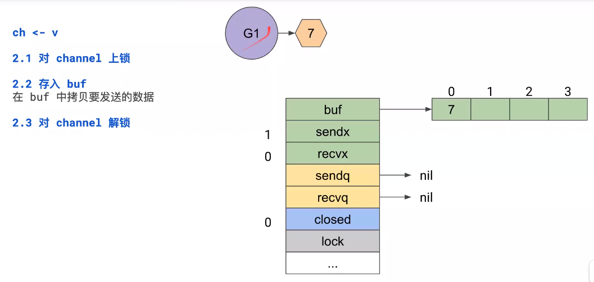
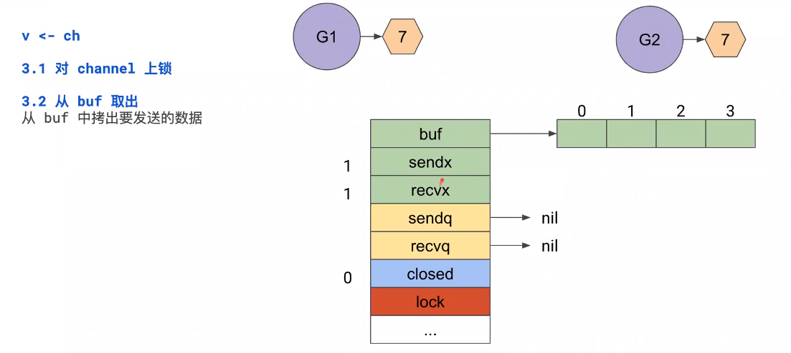
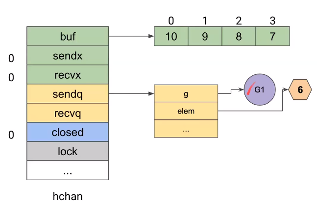
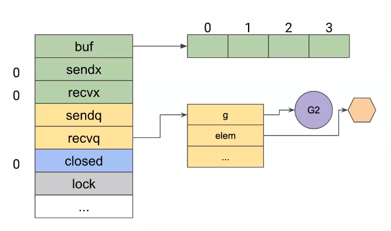
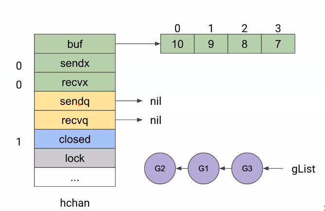
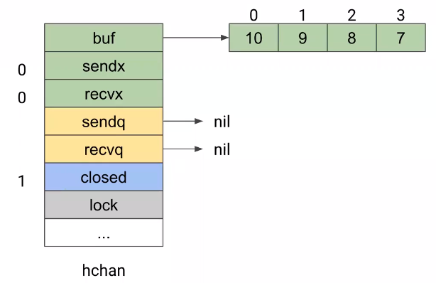
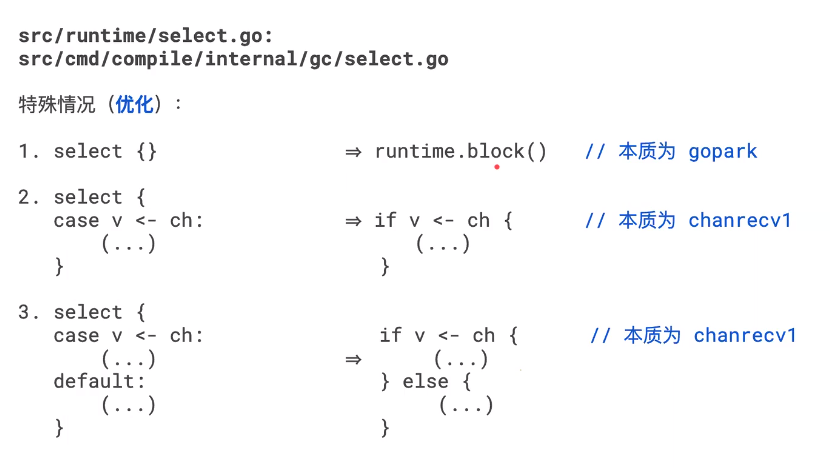
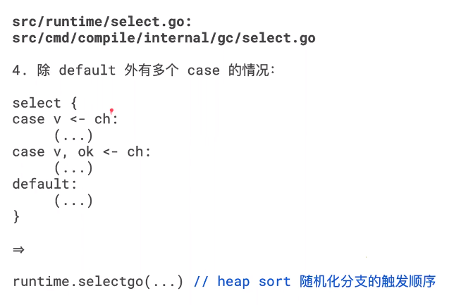

### GO 内存模型

happens before 偏序（≤）

在 channel 中体现为：

-   buffered: `ch <- v ≤ v <- ch`
- unbuffered: `v <- ch ≤ ch <- v`

好像不太符合直觉

- buffered channel 生产数据并存入 buffer,然后 reader 从 buffer 中进行消费
- unbuffered channel 会阻塞到 reader 从 channel 中 读取数据

现在似乎符合直觉了

### select 

zero-case
```go
select {}
```

uni-case
```go
select {
case ch <- v:
    (...)
}
```

multi-case
```go
select {
case v1 <- ch1:
    (...)
case v2 <- ch2:
    (...)
default:
    (...)
}
```


### channel

`src/runtime/chan.go`

1. 
- `make(chan interface{}, size)` -> `runtime.makechan(interface{}, size)`  
- `make(chan interface{}, size)` -> `runtime.makechan(interface{}, 0)`  

2. `ch <-v` ->  `runtime.chansend1(ch, &v)`
3.   
- `v <- ch` -> `runtime.chanrecv1(ch, &v)`
- `v, ok <- ch` -> `ok := runtime.chanrecv2(ch, &v)`

4. `close(ch)` -> `runtime.closechan(ch)`


```go

type hchan struct {
	qcount   uint           // total data in the queue // 队列中的所有数据数
	dataqsiz uint           // size of the circular queue // 环形队列的大小
	buf      unsafe.Pointer // points to an array of dataqsiz elements // 指向大小为 dataqsiz 的数组
	elemsize uint16         // 元素大小
	closed   uint32         // 是否关闭
	elemtype *_type // element type // 元素类型
	sendx    uint   // send index // 发送索引
	recvx    uint   // receive index // 接受索引
	recvq    waitq  // list of recv waiters // 等待列表，即( <- chan)
	sendq    waitq  // list of send waiters // 等待列表，即（ch <- ）

    // lock 保护了 hchan 的所有字段，以及此 channel 上阻塞的 sudog 的一些字段
    // 当持有此锁时不应该改变其他 G 的状态（特别的，不 reday 一个 G），因为它会在栈收缩时发生死锁
	// lock protects all fields in hchan, as well as several
	// fields in sudogs blocked on this channel.
	//
	// Do not change another G's status while holding this lock
	// (in particular, do not ready a G), as this can deadlock
	// with stack shrinking.
	lock mutex
}

type waitq struct {
	first *sudog
	last  *sudog
}

// sudog represents a g in a wait list, such as for sending/receiving
// on a channel.
//
// sudog is necessary because the g ↔ synchronization object relation
// is many-to-many. A g can be on many wait lists, so there may be
// many sudogs for one g; and many gs may be waiting on the same
// synchronization object, so there may be many sudogs for one object.
//
// sudogs are allocated from a special pool. Use acquireSudog and
// releaseSudog to allocate and free them.
type sudog struct {
	// The following fields are protected by the hchan.lock of the
	// channel this sudog is blocking on. shrinkstack depends on
	// this for sudogs involved in channel ops.

	// 由 sudog 阻塞的通道的 hchan.lock 进行保护
	g          *g
	// 表示 g 正在参与一个 select，因此 g.selectDone 必须以 CAS 的方式来避免唤醒时候的  data race.
	selectdone *uint32 // CAS to 1 to win select race (may point to stack)
	next       *sudog
	prev       *sudog
	elem       unsafe.Pointer // data element (may point to stack) // 数据元素（可能指向栈）
	
	// 下面的字段有缘不会并发的被访问，对于 channel waitlink 只会被 g 访问
	// 对于 semaphores, 所有的字段（包括上面的）只会在持有 semaRoot 锁时被访问

	// The following fields are never accessed concurrently.
	// For channels, waitlink is only accessed by g.
	// For semaphores, all fields (including the ones above)
	// are only accessed when holding a semaRoot lock.

	acquiretime int64
	releasetime int64
	ticket      uint32
	parent      *sudog // semaRoot binary tree // semaRoot 二叉树
	waitlink    *sudog // g.waiting list or semaRoot // g.waiting 列表 或 semaRoot
	waittail    *sudog // semaRoot // semaRoot
	c           *hchan // channel // channel
}

```


### 1. 创建 channel

1.1 buffered  
    
make(chan interface{}, 4)
    
1.1.1 分配 hchan
从堆中分配，所有字段均为零值

1.1.2 分配 ring buffer

从堆中分配，根据给定大小创建

1.2 unbuffered

1.2.1 分配 hchan
从堆中分配，所有字段均为零值

1.2.2 不分配 ring buffer

> 到目前为止未发现 buffered 和 unbuffered 存在任何差异

> 实际视线中，分配过程是一次性完成的，hchan 及其 ring buffer 是一段连续的内存

### 2. 从 buffered channel 发送数据




2.1 buf 是 empty 的

ch <- v

2.1.1 对 channel 上锁

2.1.2 存入 buf  
在 buf 中拷贝(memory copy)要发送的数据

2.1.3 对 channel 解锁

### 3. 从 buffered channel 接受数据




v <- ch 

3.1.1 对 channel 上锁

3.1.2 从 buf 取出
从 buf 中拷出要发送的数据

3.1.3 对 channel 解锁

### 4. 如果发送的时候 buf 已满呢？




- `ch <- v`  

发送方 g1

1. 使用 sudog 包裹 g 和 要发送的数据

2. 入队 sendq

3. gopark  
    + m 解除当前的 g  
    + m 重新进入调度循环  
    + 这个时候的 g 没有进入调度队列
      
   
- `v <- ch`  
假设出现了一个新的接收方 g2

1. sendq 出队

2. 从 buf 拷贝队头（拿走 ring buf 队头的数据）   

3. 从 sender 拷贝到队尾 (sendq 中 g1 的数据写到刚刚/原来的位置 )  

4. goready  (g1 数据被拷走后，就会被重新放到 p 的队列里)
    + 放入调度队列
    + 等待被调度
    

### 5. 如果接收的时候 buf 为空呢？




- `v <- ch`  
接收方 g2

1. 使用 sudog 包裹 g 和接收数据的位置

2. 入队 recvq   

3. gopark  (g1 数据被拷走后，就会被重新放到 p 的队列里)
    + m 解除当前的 g
    + m 重新进入调度循环
    + 这个时候的 g 没有进入调度队列
    

- `ch <- v`   

假设出现了一个新的发送方 g1

1. 出队 recvq

2. 直接写入 G2 执行栈**（优化）**(从 g1 直接写入 g2，不用再往 ring buf 里面写了)  

3. goready

**注：整个过程没有 buf 的参与，与 unbuffered 的情况一模一样。**


### 6. 关闭 channel




- `close(ch)`

1. 加锁

2. closed = 1

3. ready 所有 sendq 和 recvq

4. 解锁

### 7. 如何读取一个已关闭的 channel



1. sendq 和 recvq 肯定为 nil

2. buf 可能不为空

3. 为空则清零 reader 的读取位置

4. 不为空则继续读 buf







