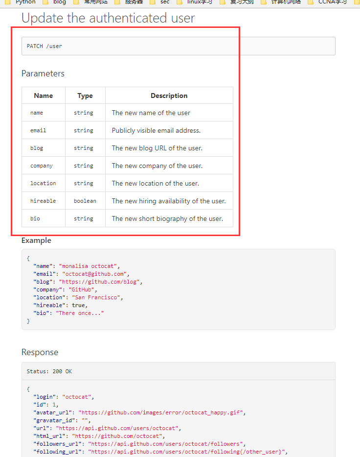
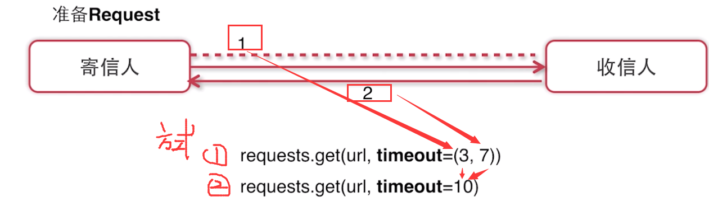
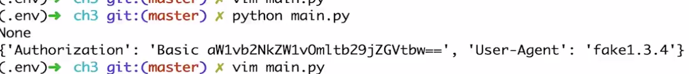
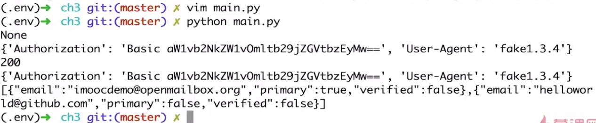

# Requests模块学习之一发送请求

<pre>
GitHub API
URL:https://developer.github.com/
</pre>

## 1.1 请求方法
- GET: 查看资源
- POST: 增加资源
- PUT: 修改资源
- DELETE: 删除资源
- HEAD: 查看响应头
- OPTIONS: 查看可用请求方法

**requests.\[method\](url)**

<pre>
#!/usr/bin/env python
# -*- coding:utf-8 -*-

__Author__ = "HackFun"
__Date__ = '2017/9/28 23:15'

import requests
import json

URL = 'https://api.github.com'

def build_uri(endpoint):
    return '/'.join([URL, endpoint])

def better_print(json_str):
    return json.dumps(json.loads(json_str), indent=4)

def request_method():
    response = requests.get(build_uri('user/emails'), auth=('hackfeng624@gmail.com', 'qqq@123456'))
    print better_print(response.text)
    
if __name__ == '__main__':
    request_method()
</pre>

## 1.2 带参数的请求

1.URL Parameters：URL参数

- https://list.tmall.com/search_product.htm?cat=50514037&...

- params:requests.get(url,params={'key1': 'value1'})

2.表单参数提交：

- Content-Type: application/x-www-form-urlencoded
- 内容： key1=value1&key2=value2
- request.post(url, data={'key1': 'value1', 'key2': 'value2'})

3.json参数提交

- Content-Type:application/json
- 内容: '{"key1": "value1", "key2": "value2"}' 
- requests.post(url, json={'key1': 'value1', 'key2': 'value2'})

---
### 例子1：
[https://developer.github.com/v3/users/#parameters-1](https://developer.github.com/v3/users/#parameters-1)

<pre>
def params_request():
    response = requests.get(build_uri('users'), params={'since': 11})
    print better_print(response.text)
    print response.request.headers
    print response.url
</pre>
### 结果1

---

### 例子2：

[https://developer.github.com/v3/users/#update-the-authenticated-user](https://developer.github.com/v3/users/#update-the-authenticated-user)

<pre>
def json_request():
    response = requests.patch(build_uri('user'), auth=('hackfeng624@gmail.com', 'xxxx'), json={"name": 'hackfun', "email": "xxx@xxx.com"})
    print better_print(response.text)
    print response.request.headers
    print response.request.body
    print response.status_code
</pre>
### 结果2

---

### 例子3：

代码添加email

<pre>
def json_request():
    response = requests.patch(build_uri('user/emails'), auth=('hackfeng624@gmail.com', 'xxxx'), json=["xxxx@xxx.com"])

    print better_print(response.text)
    print response.request.headers
    print response.request.body
    print response.status_code
</pre>

### 结果3

---

## 3.3 请求异常处理

<pre>
异常类型：
BaseHTTPError
ChunkedEncodingError
ConnectionTimeout
ConnectionError
ContentDecodingError
HTTPError
InvalidSchema
InvalidURL
MissingSchema
ProxyError
ReadTimeout
RequestException
RetryError
SSLError
StreamConsumedError
Timeout
TooManyRedirects
URLRequired
</pre>

### 处理异常代码
<pre>
def timeout_request():
    try:
        response = requests.get(build_uri('user/emails'), timeout=0,1)
    except exceptions.Timeout as e:
        print e.message
    else:
        print response.text
</pre>

### 结果

---

### status_code 异常

<pre>
def timeout_request():
    try:
        response = requests.get(build_uri('user/emails'), timeout=0.1)
        response.raise_for_status()
    except exceptions.Timeout as e:
        print e.message
    except exceptions.HTTPError as e:
        print e.message
    else:
        print response.text
        print response.status_code.code
</pre>

### 结果

## 3.4 自定义Request

<pre>
class Request:的构造函数
__init__(self,
            method=None, url=None, headers=None, files=None, data=None,
            params=None, auth=None, cookies=None, hooks=None, json=None):
</pre>
### 代码1
<pre>
def hard_requests():
    from requests import Session, Request
    s = Session()
    headers = {'User-Agent': 'fake1.3.4'}
    req = Request('GET', build_uri('user/emails'), auth=('hackfeng624@gmail.com', 'xxxx'), headers=headers)
    prepped = req.prepare()
    print prepped.body
    print prepped.headers
</pre>
### 结果1

### 代码2
<pre>
def hard_requests():
    from requests import Session, Request
    s = Session()
    headers = {'User-Agent': 'fake1.3.4'}
    req = Request('GET', build_uri('user/emails'), auth=('hackfeng624@gmail.com', 'xxxx'), headers=headers)
    prepped = req.prepare()
    print prepped.body
    print prepped.headers

    resp = s.send(prepped, timeout=5)
    print resp.status_code
    print resp.request.headers
    print resp.text
</pre>
### 结果2

## 参考

[慕课网-Python-走进Requests库](http://www.imooc.com/learn/736)