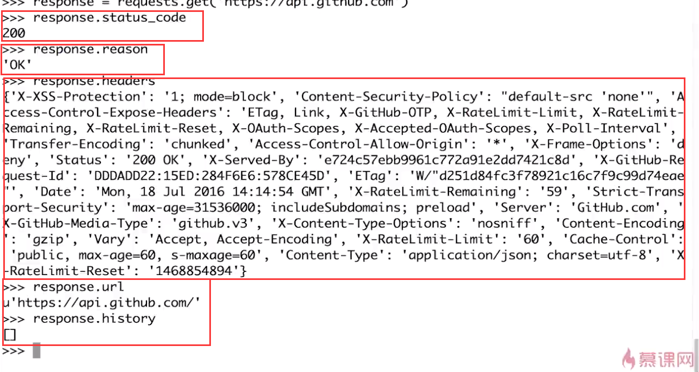
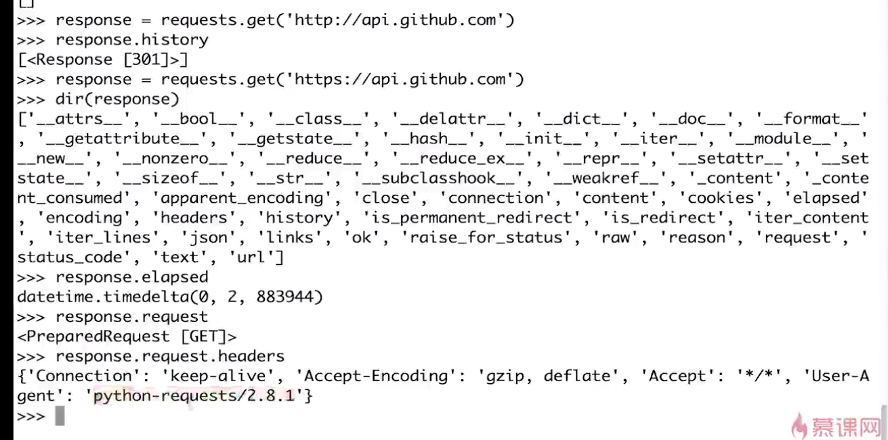
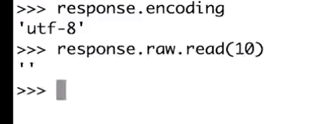
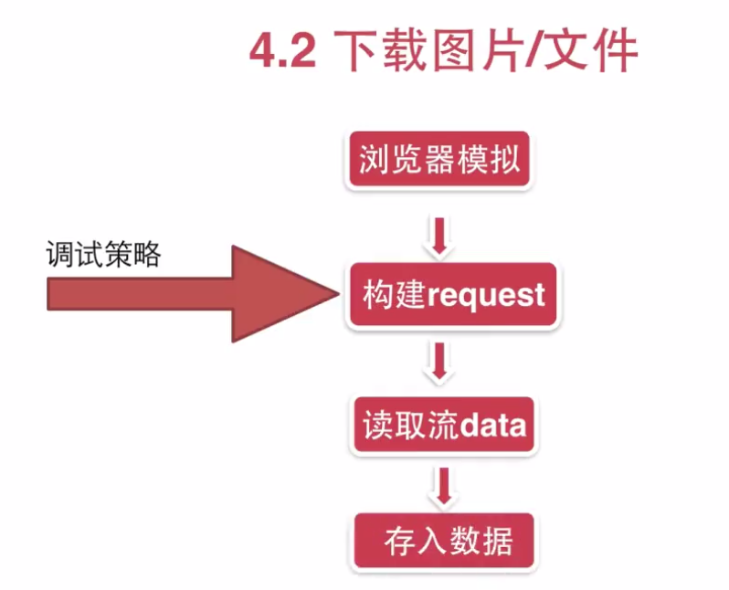

# Requests模块学习二处理响应

<pre>
GitHub API
URL:https://developer.github.com/
</pre>

## 2.1 响应基本API
<pre>
status_code
reason：'OK','Forbidden'之类的
headers
url
history ：历史信息，比如3xx重定向的一些跳转信息
elapsed ： 耗费的时间
request ：找到请求的对象

响应主体api：
encoding：是什么编码
raw：相当于读文件一样
content： byte （str格式）
text：unicode（经过解析过的）
json：json格式
</pre>

### 例子演示1

### 例子演示2

### 例子演示3

### 例子演示4

### 例子演示5

### 例子演示6

### 例子演示7

## 2.2 下载图片/文件

<pre>
def download_request():
    """demo下载图片
    """
    url = "http://img.sootuu.com/vector/2006-4/2006420114643989.jpg"
    response = requests.get(url, stream=True)

    print response.status_code, response.reason
    print response.headers
    with open('image.jpg', 'wb') as f:
        f.write(response.content)
对于较大的图片上面代码是比较耗费资源的
</pre>

### 优化后代码
<pre>
def download_request():
    """demo下载图片
    """
    url = "http://img.sootuu.com/vector/2006-4/2006420114643989.jpg"

    from contextlib import closing
    with closing(requests.get(url, stream=True)) as response:
        with open('demo.jpg', 'wb') as fd:
            for chunk in response.iter_content(128):
                fd.write(chunk)

    print response.status_code, response.reason
    print response.headers

</pre>

## 2.3 事件钩子（Event Hooks）

<pre>
#!/usr/bin/env python
# -*- coding:utf-8 -*-

__Author__ = "HackFun"
__Date__ = '2017/9/28 10:25'

import requests

def get_key_info(response, *args, **kwargs):
    """回调函数
    """
    print response.headers['Content-Type']
    print dir(response)

def main():
    """主程序
    """
    requests.get('https://www.baidu.com', hooks=dict(response=get_key_info))

if __name__ == '__main__':
    main()

>>>
text/html
['__attrs__', '__bool__', '__class__', '__delattr__', '__dict__', '__doc__', '__enter__', '__exit__', '__format__', '__getattribute__', '__getstate__', '__hash__', '__init__', '__iter__', '__module__', '__new__', '__nonzero__', '__reduce__', '__reduce_ex__', '__repr__', '__setattr__', '__setstate__', '__sizeof__', '__str__', '__subclasshook__', '__weakref__', '_content', '_content_consumed', '_next', 'apparent_encoding', 'close', 'connection', 'content', 'cookies', 'elapsed', 'encoding', 'headers', 'history', 'is_permanent_redirect', 'is_redirect', 'iter_content', 'iter_lines', 'json', 'links', 'next', 'ok', 'raise_for_status', 'raw', 'reason', 'request', 'status_code', 'text', 'url']
</pre>

## 参考

[慕课网-Python-走进Requests库](http://www.imooc.com/learn/736)