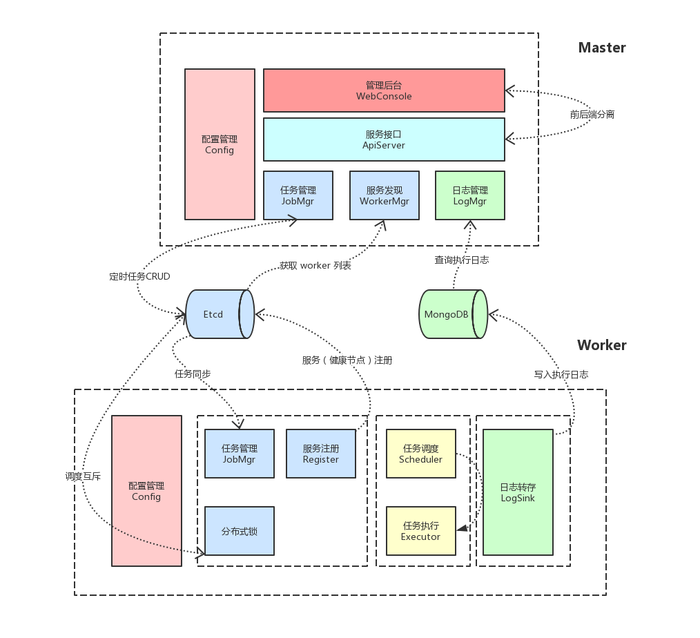

## Golang 开发分布式任务调度

---

### 目录

[1. 架构图](#1-架构图)

[2. 项目主体结构](#2-项目主体结构)

[3. 其他 Golang 项目](#3-其他-Golang-项目)

   
### 1. 架构图

### 2. 项目主体结构

- ##### Master  
    - [ApiServer](./crontab/master/ApiServer.go) 管理后台（提供 HTTP 接口 及 前端界面，提升服务使用友好度）
    - [Config](./crontab/master/Config.go) 配置管理（加载服务必须配置）
    - [JobMgr](./crontab/master/JobMgr.go) 任务管理（任务 CRUD 至 etcd，GET/PUT/DELETE：/cron/jobs/目录下的所有任务）
    - [LogMgr](./crontab/master/LogMgr.go) 日志管理（日志查询，从 MongoDB 查询执行日志）
    - [WorkerMgr](./crontab/master/WorkerMgr.go) 服务发现（健康节点监控，GET 目录 /cron/workers/{IP地址}）
- ##### Worker  
    - [Config](./crontab/worker/Config.go) 配置管理（加载服务必须配置）
    - [Executor](./crontab/worker/Executor.go) 任务执行（执行一个任务）
    - [JobLock](./crontab/worker/JobLock.go) 分布式锁（etcd 授予租约机制，实现 分布式锁）
    - [JobMgr](./crontab/worker/JobMgr.go) 任务管理（etcd watch 机制，监听 /cron/jobs/目录下的所有任务 revision 向后监听变化事件）
    - [LogSink](./crontab/worker/LogSink.go) 日志转存（channel + 定时器 定时 buffer，批量写入执行日志 至 MongoDB）
    - [Register](./crontab/worker/Register.go) 服务注册 （获取服务器网卡IP地址，并通过 租约机制，注册到目录：/cron/workers/{IP地址}）
    - [Scheduler](./crontab/worker/Scheduler.go)  任务调度 （任务事件channel + 任务调度计划表 + 任务执行表 + 任务执行结果channel，实现调度）
- ##### TODO
    - master 选主  
        - 抢占 etcd 乐观锁 /cron/master  
        - 抢到锁的成为 leader 并持续续租    

    - 任务超时控制  
        - web 增加任务超时配置项  
        - worker 支持超时检查  
        - 任务超时在日志中得到体现  
        
    - 任务失败告警 
        - etcd 写入每秒 1000次  
        - 任务失败告警，不适宜使用 etcd，使用消息队列  

### 3. 其他 Golang 项目

- [原生爬虫](https://github.com/hackfengJam/golearn/tree/master/project/crawler)    
- [流量统计系统](https://github.com/hackfengJam/golearn/tree/master/project/analysis)  
- [搭建并行处理管道 - 外部排序](https://github.com/hackfengJam/golearn/tree/master/project/gointro)  

### 感谢

- [etcd 官网](https://etcd.io/)

- [etcd 官方文档](https://etcd.io/docs/v3.3.12/)

- [Raft 英文 paper pdf](https://ramcloud.atlassian.net/wiki/download/attachments/6586375/raft.pdf)
  
- [Raft 作者油管讲解视频](https://www.youtube.com/watch?v=YbZ3zDzDnrw&feature=youtu.be)
