## 如何设计并实现一个高可用订单系统

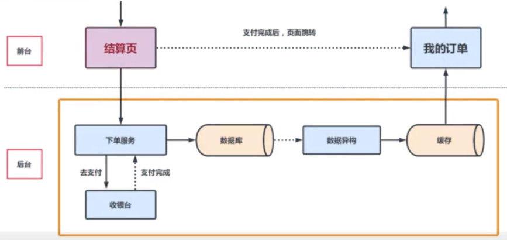

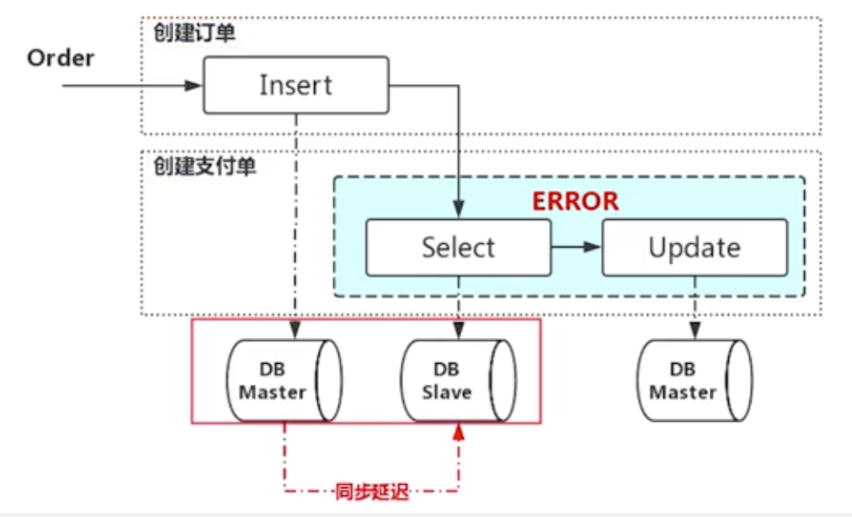

- 订单补偿不要粗暴地使用消息队列的方式，避免中间件引发的订单丢失  
- 关键逻辑也不要使用缓存来进行订单的查询  

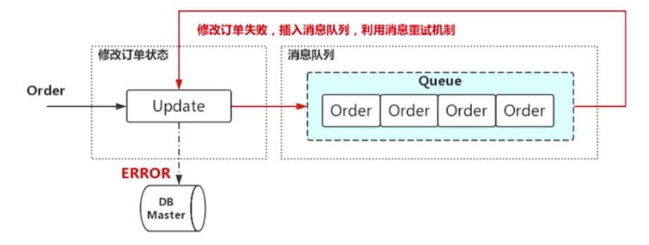

- 接收消息处理失败时一定要让消息重试，避免丢失

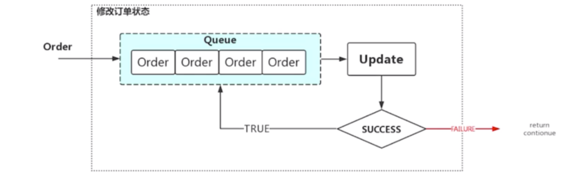

- 尤其注意 return、continue 等关键字

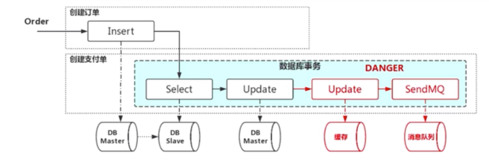

- 写数据库时，数据库事务的粒度不要太大，避免锁表，关注慢SQL

- 关注数据易购的性能和稳定性，尤其在网络抖动的情况下，可能会影响用户体验

- 要关注订单系统的幂等性，避免出现计费等锁雾，影响后续操作等流程

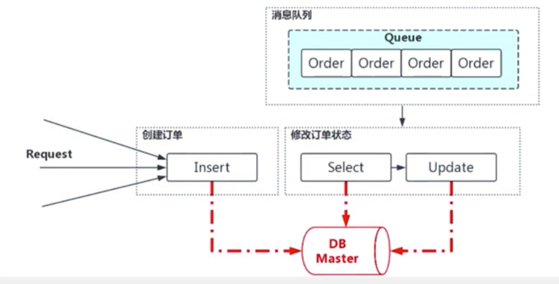

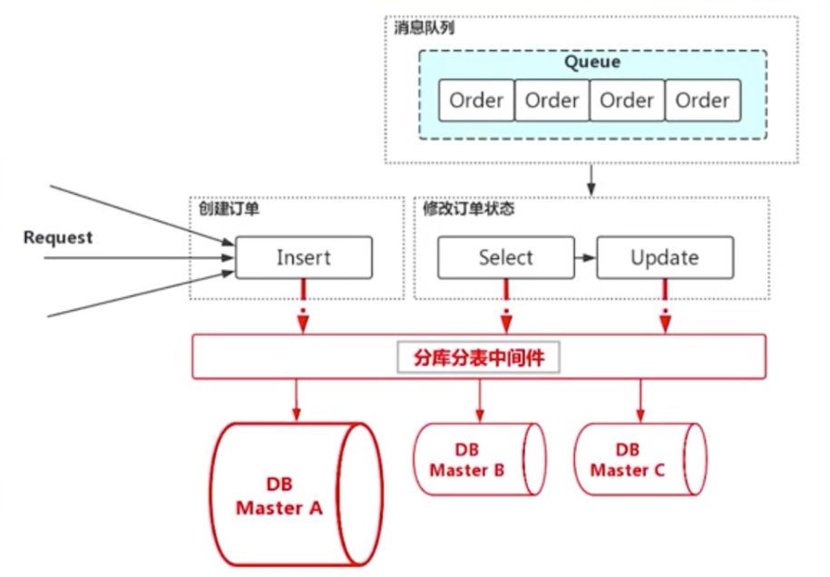

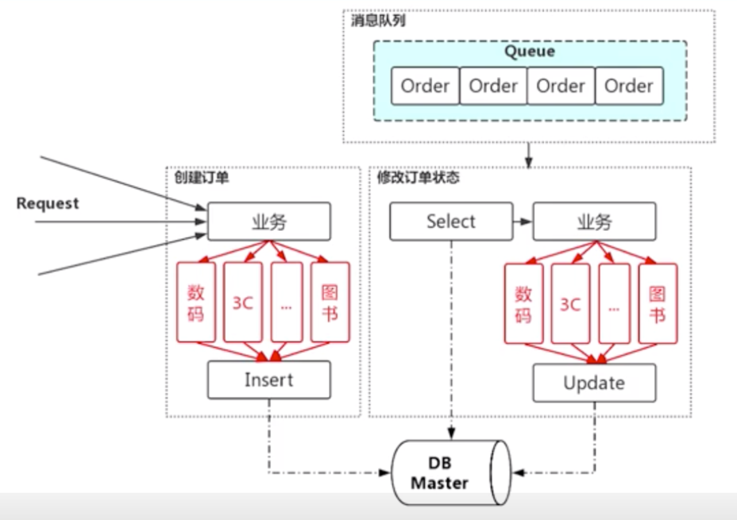

- 下单服务处理接单慢

- 数据库压力大

- 数据异构延迟高

- 缓存数据质量差

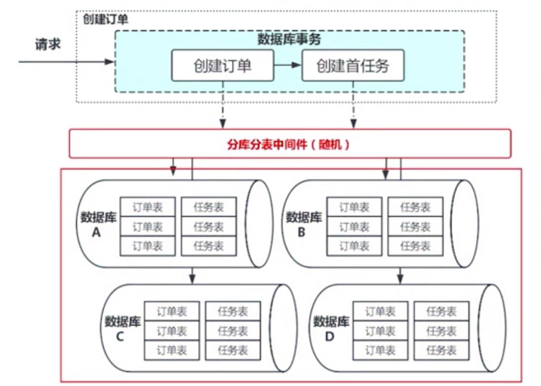

- 下单服务：接单服务 -> 订单引擎 -> 订单管道

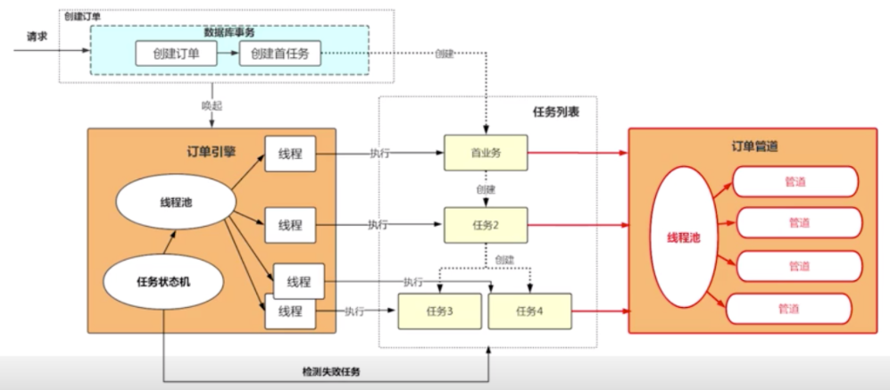

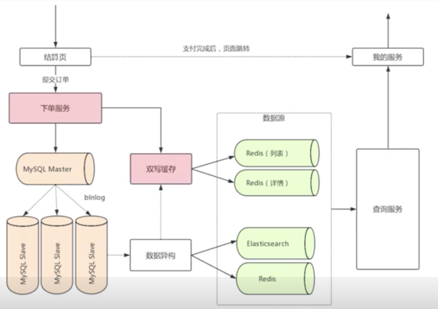

- 结算页：支付完成后，页面调转到 我的服务

- 提交订单 -> 下单服务

- 下单服务
    - 写 MySQL master，双写缓存
    - 通过 binlog 同步 MYSQL slave -> 数据异构 -> 缓存
    
    
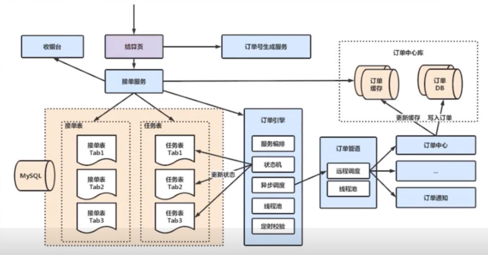

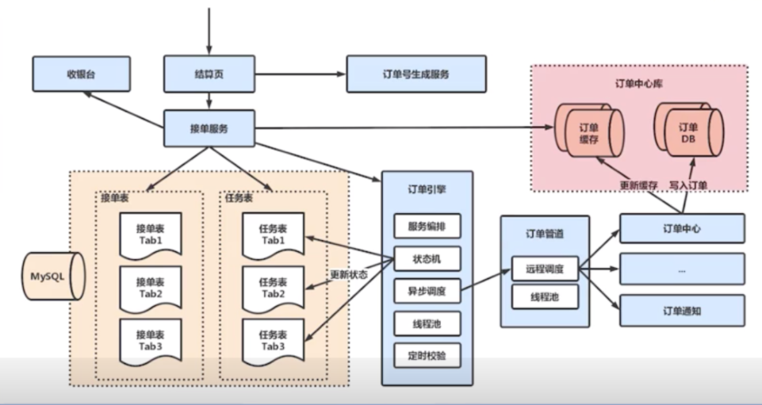

### DB 使用云产品

order_17.png

### 感谢

- [极客时间](https://time.geekbang.org/)