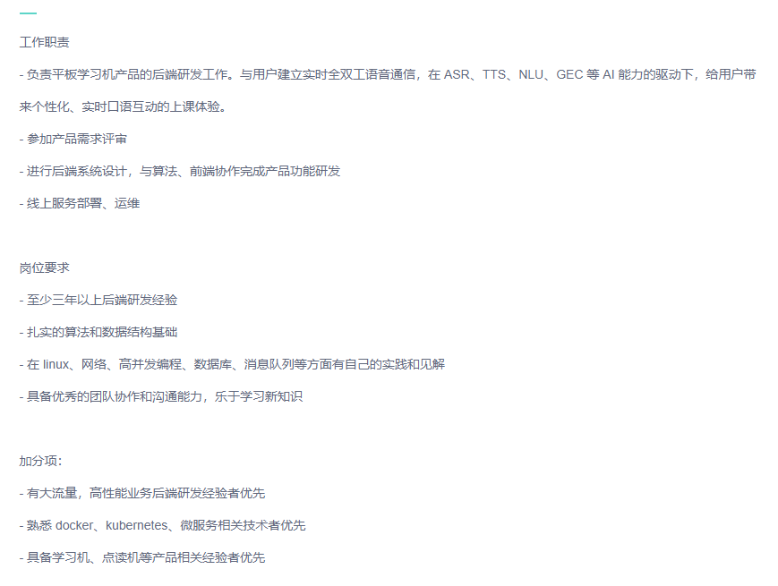

## 英语流利说 —— 面经

#### 2020年xx月xx日

#### 目录

- [1. 先看一下 jd](#1-先看一下-jd)
- [2. 本人大致情况](#2-本人大致情况)
- [3. 此次流程](#3-此次流程)
    - [3.1 一轮技术面](#31-一轮技术面)
    - [3.2 二轮技术面](#32-二轮技术面)
    - [3.3 三轮技术面](#33-三轮技术面)
    - [3.4 四轮技术面](#34-四轮技术面)
    - [3.5 五轮技术面](#35-五轮技术面)
    - [3.6 HR 面](#36-HR-面)

- [4. 结果](#4-结果)

- [5. 总结](#5总结)

### 1. 先看一下 jd

注：[链接](https://www.zhipin.com/job_detail/ae4b42c8e320b3483nBz39u0EFY~.html?ka=hot-job-1)

### 2. 本人大致情况

- 18年毕业，17年11月份实习
    - 2017.11 - 2019.08 某C轮小厂 -  Python开发工程师
    - 2019.08 - 至今 上海突进科技有限公司 - Golang开发工程师

### 3. 此次流程

#### 3.1 一轮技术面

第一轮是：电面

- go 的并发怎么做的    
- goroutine 和 其他语言常见的多线程 有什么区别   
- 介绍 goroutine   
- go routine 如何同步    
- go channel 底层    
- gmp   
- 介绍 context   
- 自己实现 timeout 怎么做   
- 实现有序 map    
- kafka 存储机制   
- consul 平时用来做什么    
- 说一下 raft    
- redis zset 底层实现    
- 一主、多主    

#### 3.2 二轮技术面

- 自我介绍  

- git rebase、merge

- 看你有了解过安全，问下这方面吧
    - 中间人攻击、重放攻击和嗅探？    
    - 防重放攻击怎么实现的？    
    - 幂等怎么处理？  
    - sql 注入，怎么预防的？   
    - 描述下 https    
    - https 用的加密协议，与之前 RSA 有什么不同 。 xxxK（没了解过） ?   

- 说一下你参与   
    - 密钥服务项目  
    - 参与的支付重构项目  

- 集群内部微服务之间负载均衡用的什么，在哪端做的

- 平时服务监控怎么做的  
    - 介绍了平时都会关注哪些监控，包括制定的一些业务监控  
    - 顺带提了一下最近做的，支付渠道业务降级  

- 聊了聊 ACM 

- 做题  
    - 灯泡开关问题

#### 3.3 三轮技术面

- 说一下你参与的会员签约项目  
    - 会员续约怎么做的

- 服务用的是否是物理机

- 30 亿的数据表，你觉得该怎么优化  
    - 分库分表，双写不一致问题处理  

- 说一下你的参与的基建工作    
    - 简单介绍了下我们当前的 workflow ，平时发布流程    
    - 然后讨论了下 service mesh（所谓的）    

- 设计：用户学习打卡，功能点：打卡、补打卡、查看连续打卡天数、总打卡天数、查看一段时间打卡日历

- 扯了点其他的，有点忘记了

- 做题  
    - go defer  
    - 连续子数组的最大和  
    - 删除一次得到子数组最大和（上一题进阶）  

#### 3.4 四轮技术面

- goroutine 和 通常的线程 区别    
    - channel 同步   
    - goroutine 有遇到什么坑    
        - 聊了经历的一些事故  

- kafka   
    - 对比一下 kafka 和其他 MQ  
    - kafka 的 topic，partition  
    - kafka 如何保证不丢消息  
    - kafka 如何保证精确一次投放消息  
    - 说一下 consumer group  
    - consumer 是不是越多越好  
    - partition 是不是越多越好  
    - 业务方如何保证消费幂等  
    - 业务如何处理 消息处理失败    
    - 非法消息处理  
    - 涉及到多个 rpc 调用，某一个 rpc 出错   
    - kafka 底层用的通信协议     
        - 没答出来。面试官：用的 MQTT。我：记得之前了解 IM 服务好像用的这个协议  
    - 平时 kafka 监控这么做的  
        - 就说平时没有 kafka 权限，只能在业务这边自己定制 metrics，自己打点      
        - 然后介绍了下，去年刚来时经历的一次事故，导致 kafka 消息的堆积     

- 聊一些工作时遇到的问题    
    - 假如 有产品/Leader 告诉你，帮忙加个小功能点；但是你知道实现会使代码非常恶心。你会怎么办？  
    - 其他的有点忘记  

- 做题  
    - 判断链表存在环  

#### 3.5 五轮技术面

- 自我介绍

- 设计  
    - 实现功能：手机号发验证码、校验验证码：五分钟内所有验证码都可以用、验证码频控   

- 流控    
- 并发控制，用 go 怎么实现    
- go 的 waitGroup，errorGroup    
- 随便聊了聊技术    

- 未来岗位会做的事情    
- 聊了聊我的 github    
- 关于业务和技术的看法  
- 为什么要来流利说，上海这边去 头条、PDD 如何   

#### 3.6 HR 面

- 我   
    - Q：当前业务如何    
    - A：说了很多  
    - Q：后续工作的部门    
    - A：后续会根据评估安排岗位    

- HR  
    - Q：面试体验如何，对面试技术官感觉如何  
    - A：略  
    - Q：为什么选择流利说  
    - A：略  
    - Q：为什么要从上家离开  
    - A：略  
    - Q：选公司的时候，考虑哪些因素  
    - A：略  
    - Q：下个岗位有什么期待  
    - A：略  
    - Q：当前是否还有别的面试  
    - A：略  
    - Q：薪资问题  
    - A：暂时没想好。  

### 4. 结果

- continuing

### 5. 总结

- 应该是过了。因为薪资问题，我这边还没有给确定的数她们说需要商量下（周五晚上面的，说是下周给我同步）   
- 体验还是不错的，面试官人都挺不错；不是说一问一答，还是交流过程中把讨论的问题解决     
- 电面 + 现场五轮；效率很高，但是对候选人不太友好，后面有点面不动了   
- 还是有一些问到的 实际问题 值得自己后续，将细节考虑清楚   

#### TODO

- 面试答案未及时整理，后续补充，感谢持续关注:)

#### 感谢

- 感谢面试官  
- 感谢 HR