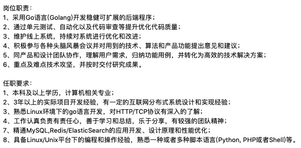

## 识货 —— 面经

#### 2020年xx月xx日

#### 目录

- [1. 先看一下 jd](#1-先看一下-jd)
- [2. 本人大致情况](#2-本人大致情况)
- [3. 此次流程](#3此次流程)
    - [3.1 一轮技术面](#31-一轮技术面)

- [4. 结果](#4-结果)

- [5. 总结](#5总结)

### 1. 先看一下 jd

### 2. 本人大致情况

- 18年毕业，17年11月份实习
    - 2017.11 - 2019.08 某C轮小厂 -  Python开发工程师
    - 2019.08 - 至今 上海突进科技有限公司 - Golang开发工程师

### 3. 此次流程

#### 3.1 一轮技术面

先给了几道题  
 - golang 里面 channel 是什么？原理是什么？  
 - golang 里面 map 是怎么实现的？为什么并发不安全？有没有 不加锁并发安全的 map  
 - go 里面可读锁和互斥锁？怎么实现的，它们区别是是什么？  
 - 平时怎么排查问题的？  
 - http1、http2 和 grpc 的关系与区别  
 - redis zeset、hashmap 底层是什么  
 - 描述自己平时使用较多的两个mq，并对比它们差异  
 - golang里面逃逸分析是怎么样的？如何避免内存逃逸  
 - mysql 如何主动加锁和被动加锁   

开始面试

- 聊一下项目

- 看过 go 的源码吗？

- 实现一个迭代器用 channel 

- map 怎么实现的？

- 内存对齐

- sync 包下都有那些东西  
    - sync pool 一般什么时候用  
    - 并发和互斥锁怎么实现  
    - Map 实现  
    - 原子操作底层原理  

- 说一下 https 

- 说一下 mysql 的 MVCC

- redis 为什么这么快  
- redis 用过哪些数据结构？ list、set 一般什么场景使用  
- epoll? 红黑树说一下  

### 4. 结果

__挂了__

### 5. 总结

- 面试官评价：我觉得你基础非常好，但是业务描述能力不行，让人觉得你做的业务过于简单；甚至会对你业务理解与处理能力没有信心。

- 反思  
    - 这次面试完，需要准备下做的业务    
    - 最好能做到有信心，向一个完全不了解该业务的技术，描述清楚    

#### TODO

- 面试答案未及时整理，后续补充，感谢持续关注:)

#### 感谢

- 感谢猎头推荐  
- 感谢此轮面试官时间成本，给予宝贵建议
