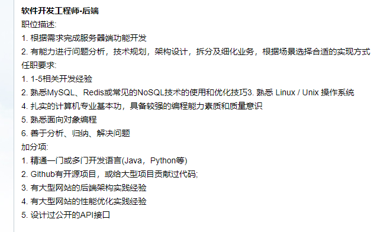

## 某不知名小厂面经

#### 2019年5月28日

#### 目录

- [1. 先看一下 jd](#1-先看一下-jd)
- [2. 本人大致情况](#2-本人大致情况)
- [3. 和猎头说的期望](#3-和猎头说的期望)
- [4. 此次流程](#4此次流程)
    - [4.1 初筛](#41-初筛)
        - [4.1.1 给了一道题目，以附件形式提交](#411-给了一道题目然后以附件形式提交)
        - [4.1.2 结果](#412-结果)
        - [4.1.3 接下来流程](#413-接下来流程)
    - [4.2 两轮技术面](#42-两轮技术面)
        - [4.2.1 一面](#421-一面)
            - [4.2.1.1 聊自己写的项目](#4211-所写的项目哪些有对你帮助很多有什么挑战如何克服的学到了什么)
            - [4.2.1.2 MySQL 了解多少？](#4212-mysql-了解多少)
            - [4.2.1.3 设计一个点赞系统](#4213-设计一个-微博帖子post的-点赞系统)
            - [4.2.1.4 一面总结](#4214-一面总结)
        - [4.2.2 二面](#42-两轮技术面)
            - [4.2.2.1 简单的算法](#4221-一个数组长度为-n有个数出现次数大于n2找出这个数)
            - [4.2.2.2 网络](#4222-你网络还不错吧这部分直接爆炸我嗯自信满满是最骚的)
            - [4.2.2.3 二面总结](#4223-二面总结)
- [5. 总结](#5总结)

### 1. 先看一下 jd

### 2. 本人大致情况

- 18年毕业，17年11月份出去实习+转正至今（马马虎虎算一年经验了吧=。=）。

- 某C轮小厂，做 Python开发工程师。（工作制：965，算时薪比的话还是相当可观的，手动滑稽: )）

- 目前薪资：正常价格，你懂得！

### 3. 和猎头说的期望

- 对方规模不能太小，起码不能比我司还低吧
    
    - 这里指的是管理层对公司定位及产品方向还是有的，千万别是连自己做什么都不知道，那就没法玩了

- 薪资：package 25w（按 base * 12 算的，说白了就是 20k左右/月（涨幅百分之三四十吧），这是猎头提议的：低了没必要跳槽）

- 其他，貌似除了薪资其他的也没啥好说的？

题外话： 这个是直接告知到对方公司的，作为参考

### 4. 此次流程

#### 4.1 初筛

##### 4.1.1 给了一道题目，然后以附件形式提交

我提交的附件，在另外一个仓库里：[MyBlog-py3/parse](https://github.com/hackfengJam/MyBlog-py3/tree/master/parse)
包括问题描述（PS：除了 README 里面的问题描述部分，其他都是自己写的）。

##### 4.1.2 结果

通过。猎头说推了四个，我一个人过了（我也是奇怪，题目本身貌似没难度；是我文档写的太好了么=。=）

##### 4.1.3 接下来流程

现场面试：2轮技术面+HR面（2019年5月27日下午兩點开始）

#### 4.2 两轮技术面

##### 4.2.1 一面

###### 4.2.1.1 所写的项目：哪些有对你帮助很多，有什么挑战，如何克服的，学到了什么。

- 我重点说的 【[ScanEngine](https://github.com/hackfengJam/ScanEngine)】 ，这个从设计到实现基本我一个人搞定的，除了脚本部分编写。

    - 解释一下整个项目，画一下了架构图
    - 脚本什么写的（python），扩展性如何，目前（由公司其他大佬接盘，600+脚本）
    - Crontab 怎么实现的？（后续写文章聊一下（环形队列））
    - 模板模式定义脚本的输入输出，怎么保证脚本执行安全性（内部架构师团队人员review以及，容器部署）
    - 脚本异常捕捉、重试机制（聊了一堆）
    - 任务生命周期以及所有任务监控情况（聊了一堆，自己实现的监控，后续打算优化）
    - 其他的我也记不清问了啥了（聊得挺久的）
      
- 题外话

   这个项目是我公司项目，仓库里面放的是终极精简版本（连README都没有，不是我风格呀: )），后续有机会完善一下。
    
###### 4.2.1.2 MySQL 了解多少？

 - MyISAM 与 InnoDB 关于锁方面的区别
 
 - 索引管理
    - 索引好处
    - B+树、为什么不用B-树
 - 锁管理
    - 四种隔离机制
    - InnoDB 下 RR如何避免幻读（当前读和快照读、next-keys(行锁+gap锁)）
    - 其他没印象了
    
题外话：

- 关于索引管理和锁管理之前博客有谈过链接如下
    - [数据库 - 如何设计一个关系型数据库](../../tech/mysql/数据库——1_数据库架构.md)
    - [数据库 - 索引管理](../../tech/mysql/数据库——2_索引管理.md)
    - [数据库 - 锁管理](../../tech/mysql/数据库——3_锁管理.md)
    
###### 4.2.1.3 设计一个 微博帖子(post)的 点赞系统

- like count by postIds
- user like staus about post
- like / unlike
- like users list by timeline 

设计：

- 数据库，索引如何建立、
- 幂等、缓存
- 描述每个请求流程，最好简单画一下时序图
- count优化（count ++, count表）
    - 我：用redis HyperLogLog + 定期数据对齐；
    - 面试官：给了一种自愈方案，不需要定期数据对齐（或者说非冷数据基本不会用到）；算是学到了（后续待我总结一下，看看网上有没有相关讨论，系统写个笔记）

###### 4.2.1.4 一面总结

- 基本答得可以，就问了三个问题，聊的时间蛮长的。

- 可能主要是自己项目占用时间比较多，才会让后面直接进入主题的吧。

- 前两个问题基本是我再说，聊得算是不错；最后一个问题，我给了个思路，然后面试官问一下细节，不是最优方案，但还凑合，大部分设计算是合理。

- 总体来说，这一面感觉就是，如果能让面试官对你的项目感兴趣，那么你基本这轮面试就成功了，因为大部分都在谈你熟悉的东西，让你很容易发挥。

    

##### 4.2.2 二面

###### 4.2.2.1 一个数组，长度为 n，有个数出现次数大于（n/2），找出这个数

- 第一次尝试

    - 思考阶段
        - 不可能用 Map 做统计，空间太耗费了
        - 咦？三路快排思想好像不错。

    - 交流过程
        - 我：三路快排思想，每次看 等于部分的长度是否大于 n/2，如不是则丢弃这部分，并且把两边长度小于 n/2 的部分去掉。
        - 面试官：时间复杂度
        - 我：n+n/2+...+1 < 2n，所以总体 O(n)。
        - 面试官：最坏情况呢？
        - 我思考了一下。。。：额。。。终极退化。

- 第二次尝试

    - 思考阶段
        - 括号匹配思想貌似可以
        
    - 交流过程
        - 我：栈为空则入栈，否则对比栈顶元素，如果相等入栈，不相等则出栈，最后栈里剩的是大于 n/2 的元素。（栈是基于原数组基础上加了 index+size 实现的，不需要额外空间，并且出入栈时间O(1)）
        - 虽然空间O(1)，时间O(n)，时间空间复杂度确实是最优了，但是好像并不是很满意

- 第三次尝试

    - 思考阶段
        - 我去，摩尔投票法
        
    - 没有机会说了

###### 4.2.2.2 你网络还不错吧（这部分直接爆炸=。=）？我：嗯（自信满满是最“骚”的。）

- 了解 Proxy 机制吗？它的包与普通的包有什么区别？

    - 只说了表面的问题，扯了正向代理、反向代理，然后从网络分区相关点去回答，但是他貌似希望让我细聊整个 HTTP 协议细节相关，这个后续需要总结了
    
    - 简单查了一下：HTTP 1.1 以后相关
    
- HTTP 与 HTTPS 的 区别？
- HTTPS 如何做到保密的？
- 整个流程说一下？
- 如何信任 CA 什么的等等

    确实 HTTPS 问的非常细节。我只说了大致流程，细节部分基本答得不好（有点胡说的意味），并且被发现明显是来面试前随便看了一下，没仔细钻研的（挂的导火索=。=）

###### 4.2.2.3 二面总结

- 二面总的来说，答得不满意。

- 一个简单的算法问题，也答得不好；而后面几个问题问的 HTTP/HTTPS 相关的知识（然而我确实只是来前随便看了两眼），之前没有琢磨。

- 老实说：下层协议个人真心挺自信的（来自看完 《TCP/IP 详解 卷一》的自信），基本很多都 真的动手操作过（之前在学校网络安全玩的）。

- 不多说了，下一步直接把 RFC文档 翻出来，常用协议全部再看一遍，再用一下许久不用的 wireshark。

### 5. 总结

两点面到四点半，还是有所收获的。

- 总的来说，问的东西并不深奥，基本都是需要掌握的。

- 几乎没有问任何语言相关基础；本次是毕业后的第一次面试，体验还算行，这种面试节奏是我喜欢的，这次准备不够充分，以后继续努力。

本次关键：

- 心里因素，多少有一些，以后多面试，继续调整就好了。

- 二面面试官，连续三个问题答的都有瑕疵。最后问题更是直接暴露，对问题本身回答的不上心，没自己动手过的，然后用看到的表面理论乱说。（本人自己都看不下去）

- 不会直接过就好了，记住似懂非懂等于不懂（当然可能面试官有可能就是想考察这个点，直接过也有可能存在挂的风险，看情况吧）。

- 自己太菜呀：）

感谢两个面试官，也感谢猎头大哥给的帮助。继续加油。