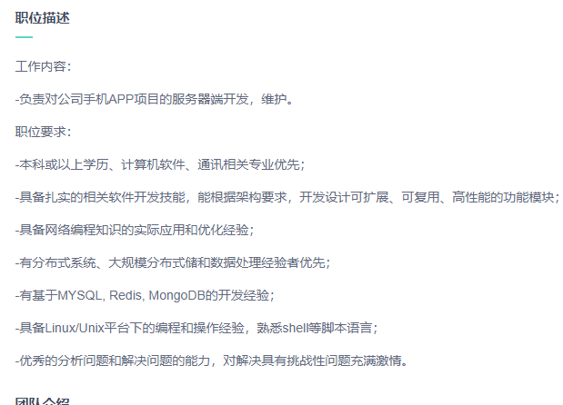

## 某不知名小厂面经 - 第二家

#### 2019年07月11日

### 前言

有很多基本和上次（[某不知名小厂面经 - 第一家](https://github.com/hackfengJam/blog/blob/master/reflection_and_summary/interview/某不知名小厂面经.md)）
描述的一致，比如[本人大致情况](#2-本人大致情况)可以直接跳过。

### 目录

- [1. 先看一下 jd](#1-先看一下-jd)
- [2. 本人大致情况](#2-本人大致情况)
- [3. 公司大致情况](#3-公司大致情况)
- [4. 此次流程](4-此次流程)
    - [4.1 面试题](#41-面试题)
    - [4.2 两轮技术面 + HR 面](#42-两轮技术面--hr-面)
        - [4.2.1 一面](#421-一面)
            - [4.2.1.1 介绍自己写的项目](#4211-介绍自己写的项目)
            - [4.2.1.2 MySQL](#4212-mysql)
            - [4.2.1.3 Redis](#4213-redis)
            - [4.2.1.4 Golang](#4214-golang)
            - [4.2.1.5 杂项](#4215-杂项)
            - [4.2.1.6 一面总结](#4216-一面总结)
        - [4.2.2 二面](#422-二面)
            - [4.2.2.1 Golang](#4221-golang)
            - [4.2.2.2 杂项](#4222-杂项)
            - [4.2.2.3 二面总结](#4223-二面总结)
        - [4.2.3 HR 面](#423-hr-面)
            - [4.2.3.1 薪资](#4231-薪资)
            - [4.2.3.2 问答阶段](#4232-问答阶段)
            - [4.2.3.3 HR面 总结](#4233-hr-面总结)
- [5. 总结](#5-总结)

### 1. 先看一下 jd

### 2. 本人大致情况

- 18年毕业，17年11月份出去实习+转正至今（马马虎虎算一年经验了吧=。=）。

- 某C轮小厂，做 Python开发工程师。（工作制：965，算时薪比的话还是相当可观的，手动滑稽: )）

- 目前薪资：正常价格，你懂得！

### 3. 公司大致情况

BOSS 上介绍的比较简单：一家做 IM 的公司，A轮，20-99 人，没啥说了。

### 4. 此次流程

#### 4.1 面试题

__现场给了一道题：__

全英文 两页，大致是给了一个协议（可能是他们公司自己定的吧或者是 IM 相关的协议）；
给了一些包结构，介绍了一堆，给了消息体 encode 和 decode 算法介绍，用自己常用语言实现 decode 方法。

#### 4.2 两轮技术面 + HR 面

##### 4.2.1 一面

###### 4.2.1.1 介绍自己写的项目

介绍ScanEngine 和上次差不多（[某不知名小厂面经系列 - 1](https://github.com/hackfengJam/blog/blob/master/reflection_and_summary/interview/%E6%9F%90%E4%B8%8D%E7%9F%A5%E5%90%8D%E5%B0%8F%E5%8E%82%E9%9D%A2%E7%BB%8F.md#4211-%E6%89%80%E5%86%99%E7%9A%84%E9%A1%B9%E7%9B%AE%E5%93%AA%E4%BA%9B%E6%9C%89%E5%AF%B9%E4%BD%A0%E5%B8%AE%E5%8A%A9%E5%BE%88%E5%A4%9A%E6%9C%89%E4%BB%80%E4%B9%88%E6%8C%91%E6%88%98%E5%A6%82%E4%BD%95%E5%85%8B%E6%9C%8D%E7%9A%84%E5%AD%A6%E5%88%B0%E4%BA%86%E4%BB%80%E4%B9%88)）

###### 4.2.1.2 MySQL

 - 建索引有什么要注意的？
 
 - 实际工作中，怎么排查 sql 相关问题

 - 写了几个 sql，怎么建索引、sql是否有问题如何修改
    
题外话：

- 关于索引管理和锁管理之前博客有谈过链接如下
    - [数据库 - 如何设计一个关系型数据库](../../tech/mysql/数据库——1_数据库架构.md)
    - [数据库 - 索引管理](../../tech/mysql/数据库——2_索引管理.md)
    - [数据库 - 锁管理](../../tech/mysql/数据库——3_锁管理.md)
    
###### 4.2.1.3 Redis

- 用 redis 做过什么  
 - 最近用了 zset 做延时队列说了一下，以及用延时 buffer 做 merge  

- 你用 redis 消息队列怎么做到可靠消费？  面试官又提了一嘴：Kafka 这方面怎么做的？  

###### 4.2.1.4 Golang

- 自己工作一直用 python 为什么学 golang

- golang 和 python 你的视角对比一下他们

###### 4.2.1.5 杂项

- 有没有遇到什么并发问题？描述了一个最近遇到的问题（后续有空写blog，感觉 TODO list 已经排满了:-)。。）

- 一个人有 100 积分，买一个 100 积分的商品，同时发三个请求，做到返回一个成功，两个失败。

- 一个商品，库存 100，整点秒杀，如何设计

###### 4.2.1.6 一面总结

- 一面花了大约接近两个小时，一个小时四五十分钟吧，从面试官反应来说，基本算答得可以。

- 问题看上去比较少，实际基于问题交流以及细节沟通都花费了一些时间。

- 能让面试官对你的项目感兴趣还是比较重要的，自己项目说了很久，参考上次[一面总结](https://github.com/hackfengJam/blog/blob/master/reflection_and_summary/interview/%E6%9F%90%E4%B8%8D%E7%9F%A5%E5%90%8D%E5%B0%8F%E5%8E%82%E9%9D%A2%E7%BB%8F.md#4214-%E4%B8%80%E9%9D%A2%E6%80%BB%E7%BB%93)

##### 4.2.2 二面

###### 4.2.2.1 Golang

- 问了我为什么用 golang，用下来感觉如何？

###### 4.2.2.2 杂项

- HTTP 协议了解多少？

- 觉得这个算法（面试题中的 decode）有什么优缺点？

- 为什么一个月才能到岗

###### 4.2.2.3 二面总结

- 感觉 CTO来就过了个场，随便聊几句，好像还挺满意的

##### 4.2.3 HR 面

###### 4.2.3.1 薪资

- 你期望薪资上面填写的是 16-20k（期望薪资填写心路历程：上次不是猎头给找的 20k 岗位凉了嘛；这回考虑薪资先猥琐点填）

- 我们这边如果给到 17-18k 的 offer，你觉得可以吗？（本人内心独白，大概率是不会来，也就不太想去争取了吧）

###### 4.2.3.2 问答阶段

- 我
    - Q：什么工作制，是否有年终？  
    - A：965，13薪  
    - Q：那加班怎么算  
    - A：平时弹性工作，周末我们目前没加过班，如果要加的话给调休  
    - Q：咱 CEO 经常在公司么  
    - A：（朝外面指了一下，CEO刚好路过）这个就是  
    - D：我这边，没问题了  
- 她
    - Q：你这边写的一个月到岗，为什么？  
    - A：不是裸辞，过来人都告诉我不要裸辞，我觉得非常有道理，所以你懂的  
    - Q：是否可以给个最快时间  
    - A：我现在提离职最快也要一个月，顶多到时候提前一周休年假过来，然后到时间去办离职手续  
    - Q：你为什么现在想要换工作  
    - A：想看看有没有新的锻炼机会  

...

__她：那最近会给你发 offer，也希望你能加入我们团队。那么，今天就到这里。（然后送我出门）__

###### 4.2.3.3 HR 面总结

- 随便扯点，没啥好总结的

### 5. 总结

- 下午两点开始面试，总共花了不到两个半小时。

- 没怎么问语言基础，没问数据结构与算法，直接问项目，然后聊实际工作问题和解决思路。

- 这次感觉不像之前那次（见：[某不知名小厂面经 - 第一家](https://github.com/hackfengJam/blog/blob/master/reflection_and_summary/interview/某不知名小厂面经.md)），
感觉没学到啥东西，不过总的来说还是可以的，起码还是给过了 ：）。

- 目前能想起来的就这些，那些问题都是临场随意发挥的，现在想有点费神，明天还有两家面试，等后续一并总结一下自己的回答吧，休息了: )。

- 继续加油:-)

- 感谢该公司给予宝贵的面试机会

#### 感谢

- 感谢三个技术面试官
