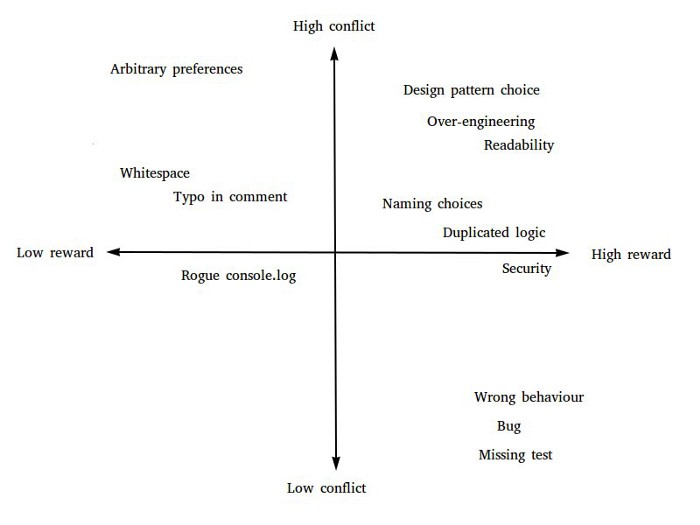

## 13 Code Review Standards Inspired by Google

> 作者 | Rafiullah Hamedy
来源 | https://medium.com/better-programming/13-code-review-standards-inspired-by-google-6b8f99f7fd67

## 以下为译文：

在本文中，我们将简要介绍13条代码审查标准，希望能够通过这些标准极大地帮助改善软件的质量，同时让开发人员保持心情愉悦。

代码审查是开发过程中的一个环节，顾名思义，代码审查需要一位或多位开发人员审查另一位开发人员（即代码的作者）编写的代码，以确保：

* 代码没有任何错误，没有bug，也没有问题；
* 代码符合质量与样式指南的要求和标准；
* 代码完成了所有预期功能；
* 合并代码后，代码库仍然能够正常运行，且达到更好的状态。

这就是为什么代码审查是软件开发的重要环节的原因。代码审查者担当着把关者的职责，负责决定这些代码是否能够成为代码库的一部分并进入生产环境。

Google以其卓越的技术而闻名世界，他们拥有高效的代码审查标准，这些标准突出了审查代码时需要牢记的一些重点。关注公众号Java技术栈回复：GG规范，还能获取一份完整的 Google 开发规范。
在Google，

>“代码审查的主要目的是确保Google代码库内整体的代码运行状况能够不断提升。” —— [Google工程实践文档](https://google.github.io/eng-practices/review/reviewer/standard.html#:~:text=The%20primary%20purpose%20of%20code,base%20is%20improving%20over%20time.&text=They%20want%20to%20ensure%20that,for%20in%20a%20code%20review.%E2%80%9D)

以下是审查代码时你需要牢记的一些重点。

### 代码审查标准：

#### 1. 这些代码能够提升系统整体的运行状况

每次代码变更（拉取请求）都能够提升系统整体的运行状况。重点在于，即便是很小的改进，合并代码后都会提升软件或代码库的运行状况。

#### 2. 快速审查代码，并给出积极地响应和反馈

首先也是最重要的一点，不可延误代码的合并。世上没有完美的代码。如果代码可以提升系统的整体运行状况，则应该立即交付这些代码。
“关键在于，世上没有完美的代码，只有更好的代码。” —— Google工程实践文档
如果手头没有紧急任务，那么请在代码提交上来后立即进行审查。响应拉取请求的时间最长不得超过一个工作日。一天之内，应针对一次拉取请求完成多轮的部分或完整的代码审查。

#### 3. 在代码审查的过程中开展教育和启发

在代码审查的过程中，应尽可能通过共享知识和经验提供指导。

#### 4. 审查代码应遵循标准

请始终牢记，样式指南、编程标准以及相关的文档应该作为代码审查的绝对权威。例如，制表符与空格的使用应保持一致，此时你可以引用编程约定。
如果你选用的是Java，那么以下文章可能会有所帮助，文中总结了大型科技公司Java编程的最佳实践：[《Java编程最佳实践摘要》](https://rhamedy.medium.com/a-short-summary-of-java-coding-best-practices-31283d0167d3)

#### 5. 解决代码审查冲突

解决代码审查冲突时，应遵循样式指南以及编程标准中商定的最佳实践，并征求其他拥有更多产品领域知识和经验的人的建议。

如果你的意见是可选或不怎么重要的，请在注释中说明，然后由作者来决定是解决还是略过。
作为代码审查者，在没有样式指南或编程标准的情况下，你至少可以建议此次代码变更与其余代码库保持一致。

#### 6. 演示UI变更是代码审查的一部分

如果代码变更涉及用户界面变化，则除了代码审查外，还需要提供演示，确保界面符合预期且与界面设计一致。
对于前端代码变更，你需要进行演示，或确保代码变更包括必要的UI自动化测试，以验证添加或更新的功能。

#### 7. 确保代码审查中包含了所有测试

除非遇到紧急情况，否则拉取请求应包含所有必要的测试，例如单元测试、集成测试以及端到端测试等。
这里所说的紧急情况指的是，某个需要尽快修复的bug或安全漏洞，而测试可以等到以后再添加。在这种情况下，请确保创建了适当的票证/问题，并确保有人负责在完成热修复或部署后立即完成测试。

我们绝对不可以跳过测试。如果时间有限，某些目标有无法实现的风险，那么解决方案不是跳过测试，而是限定可交付成果的范围。

#### 8. 不要为了代码审查打断手头的工作

如果你正在专心致志地工作，那么请不要打断自己，因为你需要花费很长时间才能重新投入工作。换句话说，打断专心工作的开发人员所付出的代价远远超过了让开发人员等待代码审查。你可以在休息（午餐或咖啡等）过后，进行代码审查。

大多数时候，整个代码审查以及代码的合并无法在一天内完成。重要的是迅速给作者一些反馈。例如，虽然可能无法完成完整的审查，但你可以快速指出一些有待探讨的地方。这可以极大地降低代码审查期间的挫败感。

#### 9. 审查所有代码，不要做任何假设

你需要审查提交上来的每一行代码。不要对人工编写的类和方法做任何假设，而且应该确保你理解代码在做什么。

确保你理解正在审核的代码。如果不理解，则请作者澄清或提供代码演示和解释。如果你不具备审核部分代码的资格，则请其他有资格的开发人员代为审查。关注公众号Java技术栈回复：GG规范，还能获取一份完整的 Google 开发规范。

#### 10. 审查代码时需要保持大局观

从更广阔的视野来看待代码变更会更有帮助。例如，某个文件被修改，并添加了4行新代码。请不要只看这4行代码，你应该考虑审查整个文件，并检查新添加的内容。它们是否会降低现有代码的质量？它们是否会导致现有功能成为重构的候选对象？
如果不在函数/方法或类的背景下审查添加的代码，则随着时间的流逝，你将会得到一个面临无法维护、纠缠不清、不易于测试等问题的类，而且这个类很难扩展或重构。
请记住，即便是微不足道的改进，随着时间的推移，也可能导致产品出现缺陷，同样，即便是轻微的代码降级或技术负债也可能在日积月累下导致产品难以维护和扩展。

#### 11. 在代码审查期间认同和鼓励出色的工作

如果看到出色的代码变更，请别忘了大力表扬和鼓励作者。代码审查的目的不仅仅是发现错误，而且还应该鼓励和指导开发人员出色的工作。

#### 12. 在代码审查期间应保持谨慎、尊重、友善和思路清晰

在代码审查期间，你应该保持友善、思路清晰、有礼貌和尊重别人，这一点至关重要，同时也要给予作者清晰的反馈和积极的帮助。在审查代码时，你需要做到对事不对人，即对代码做出评论，而非开发人员。

#### 13. 详细解释代码审查的意见，并注意尺度

每当代码审查意见提出替代方案或指出某些问题时，重要的是你需要解释其中的原因，并根据个人的知识和经验提供示例，以帮助开发人员理解为何你的建议能够提升代码质量。在建议修改或变更代码时，你需要在如何指导作者修改代码方面找到适当的平衡。例如，我更喜欢指导、解释、提示或建议，而不是整个解决方案。
