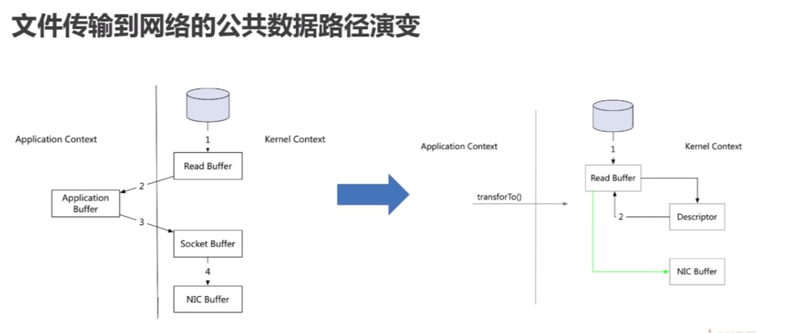

## 零拷贝

### 零拷贝简介

#### 1. 简介

- 网络传输持久性日志块

- Java Nio channel.transforTo() 方法

- Linux sendfile 系统调用

#### 2. 文件传输到网络的公共数据路径

- 操作系统将数据从磁盘读入到内核空间的页缓存

- 应用程序将数据从内核空间读入到用户空间页缓存中

- 应用程序将数据写回到内核空间到 socket 缓存中

- 操作系统将数据从 socket缓冲区 复制到 网卡缓冲区，以便将数据经网络发出

#### 3. 零拷贝过程

- 操作系统将数据从磁盘读入到内核空间的页缓存

- 将数据的位置和长度的信息的描述符增加至内核空间（socket 缓冲区）

- 操作系统将数据从内核拷贝到网卡缓冲区，以便将数据经网络发出

## 感谢

...