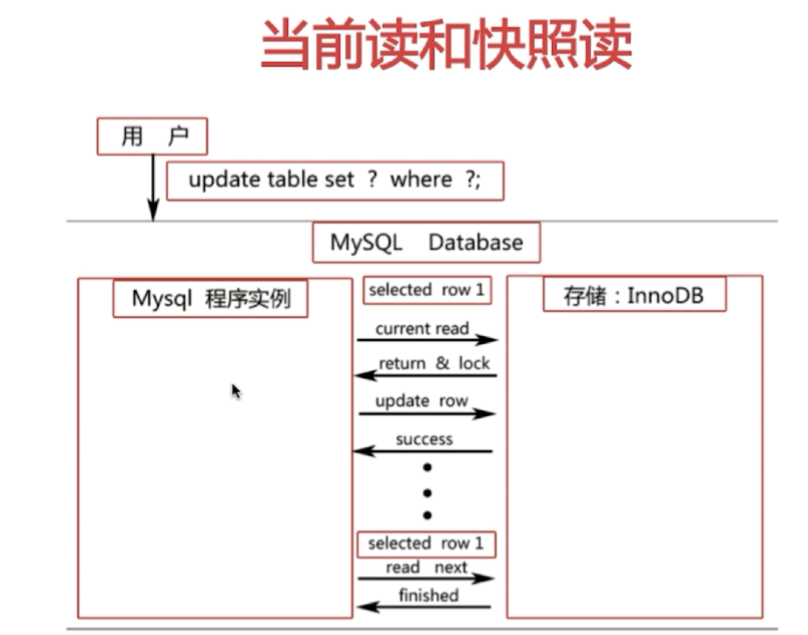
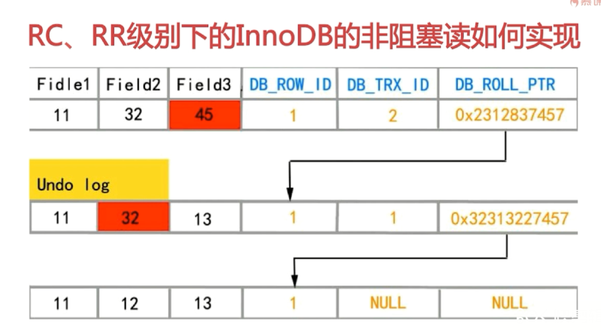
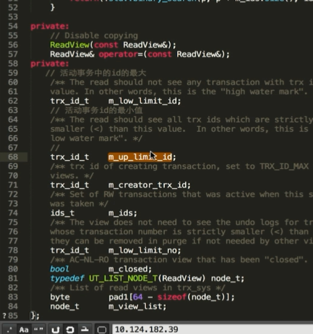
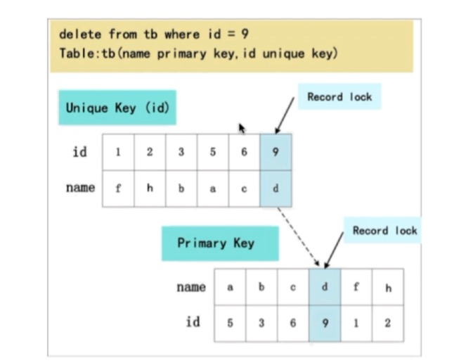
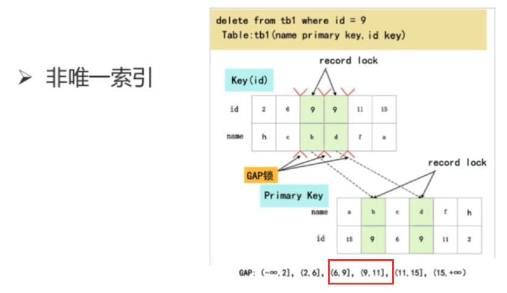
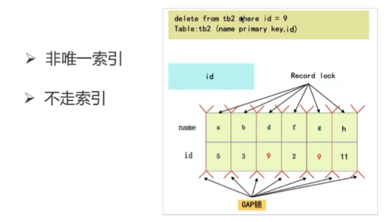

# 3. 锁管理

### 锁管理
 
 
#### 1.提出问题。

1.1 在研究索引管理之前，我们当然也先提出几个问题
    - MyISAM 与 InnoDB 关于锁方面的区别是什么？
    - 数据库的四大特性？
    - 事务隔离级别以及各级别下的并发访问问题？
    - InnoDB可重复读隔离级别下如何避免幻读？
    - RC、RR级别下的InnoDB的非阻塞度如何实现？

#### 2. 寻找答案

2.1 MyISAM 与 InnoDB 关于锁方面的区别是什么？

- MyISAM 默认用的是表级锁，不支持行级锁

- InnoDB 默认用的是行级锁，也支持表级锁

锁级别：

read锁 又可叫共享锁

write锁 又可叫排它锁

IS 共享读锁
IX  排他写锁

共享锁和排斥锁的兼容性

| - |   X   |  S   |
|---|-------|----- |
| X | 冲 突 | 冲 突 |
| S | 冲 突 | 兼 容 |

2.2 适合的场景

2.2.1 MyISAM 适合的场景

- 频繁执行全部 count 语句

- 对数据进行增删改的频率不高，查询非常频繁

- 没有事务

2.2.2 InnoDB 适合的场景

- 数据增删改查都相当频繁

- 可靠性要求比较高，要求支持事务

2.3 数据库锁的分类

- 按锁的粒度划分，可分为表级锁、行级锁、页级锁

- 按锁的级别划分，可分为共享锁、排它锁

- 按加锁的方式划分，可分为自动锁、显示锁

- 按操作划分，可分为 DML 锁、DDL 锁

- 按使用方式划分，可分为 乐观锁、悲观锁

#### 3. 数据库的四大特性？

ACID

- 原子性（Atomic）

- 一致性（Consistency）

- *隔离性*（Isolation）

- 持久性（Durability）

3.1 事务隔离级别以及各级别下的并发访问问题

3.1.1 事务并发访问引起的问题以及如何避免

- 更新丢失—— mysql 所有事务隔离级别在数据库层面上均可避免

- 脏读—— READ-COMMITTED 事务隔离级别以上可避免

- 不可重复读—— REPEATABLE-READ 事务隔离级别以上可避免

- 幻读—— SERIALIZABLE 事务隔离级别可避免

| 事务隔离级别 | 更新丢失 | 脏读 | 不可重复读 | 幻读 |
|---|---|---|----|----|
| 未提交读 | 避免 | 发生 | 发生 | 发生 |
| 已提交读 | 避免 | 避免 | 发生 | 发生 |
| 可重复读 | 避免 | 避免 | 避免 | 发生 |
| 串行化   | 避免 | 避免 | 避免 | 避免 |

注：

- oracle 默认隔离级别：read-commited
- mysql  默认隔离级别：repeatable-read

#### 4. 锁模块之 当前读 和 快照读

4.1 InnoDB 可重复读 隔离级别下如何避免幻读

- 表象：快照度（非阻塞读）—— 为 MVCC

- 内在：next-key 锁（行锁+gap锁）

4.2 当前读和快照读

- 当前读：select...lock in share mode , select...for update

- 当前读：update , delete , insert

- 快照读：不加锁的非阻塞读，select

4.3 RR、RC 级别下的 InnoDB 的非阻塞读如何实现

- 数据行里的 DB_TRX_ID、DB_ROLL_PTR、DB_ROW_ID 字段

- undo 日志

- read view

MySQL部分源码

#### 5. 锁模块之 RR 如何避免幻读

5.1 next-key 锁（行锁+gap锁）

- 行锁

- Gap 锁（[Gap Locks](https://dev.mysql.com/doc/refman/8.0/en/innodb-locking.html#innodb-gap-locks)）

5.2 对主键索引或者唯一索引是否会用 Gap 锁

- 如果 where 条件全部命中，则不会使用 Gap 锁，只会加 记录锁（[Record Locks](https://dev.mysql.com/doc/refman/8.0/en/innodb-locking.html#innodb-record-locks)）

- 如何 where 条件部分命中或者全不命中，则会加 Gap锁

**锁了 (6,11]，间隙锁范围还和主键的字母序大小有关 锁了 'c',6，插入 'bb',6 成功；而 'dd', 6 失败  **

## 感谢

[xiangzepro](https://www.imooc.com/t/4264265)

[MySQL 官方文档](https://dev.mysql.com/doc/refman/8.0/en/innodb-storage-engine.html)
