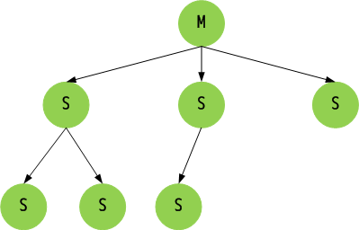

## Redis Pipeline 及 主从同步

### 目录

[1. Pipeline](#1-pipeline)  
- [1.1 使用 Pipeline 的好处](#11-使用-pipeline-的好处)  
- [1.2 批量生成 redis 测试数据](#12-批量生成-redis-测试数据)  

[2. Redis 的同步机制](#2-redis-的同步机制)  
- [2.1 同步过程](#21-同步过程)  
- [2.2 全同步过程](#22-全同步过程)  
- [2.3 增量同步过程](#23-增量同步过程)  
    
[3. Redis 哨兵](#3-redis-哨兵)

[4. 流言协议 Gossip](#3-流言协议-gossip)

### 1. Pipeline

#### 1.1 使用 Pipeline 的好处

- Pipeline 和 Linux 的管道类似

- Redis 基于 请求/响应 模型，单个请求处理需要一一应答

- Pipeline 批量执行指令，节省多次 IO 往返的时间

- 有顺序依赖的指令建议分批发送

#### 1.2 批量生成 redis 测试数据

1. **Linux Bash 下面执行**

for((i=1;1<=20000000;i++)); do echo "set k$i v$i" >> /tmp/redisTest.txt ;done;
生成 2千万 条 redis 批量设置 kv 的语句 (key=kn,value=vn) 写入到 /tmp 目录下的 redisTest.txt 文件中

2. **用 vim 去掉行尾的 ^M 符号，使用方式如下：**

vim /tmp/redisTest.txt

    :set fileformat=dos # 设置文件的格式，通过这句话去掉每行结尾的 ^M 符号
    ::wq # 保存退出
    
3. **通过 redis 提供的管道--pile 形式，跑redis，传入文件的指令批量灌入数据，需要花费10分钟左右**

    cat /tmp/redisText.txt | 路径/redis-5.0.0/src/redis-cli -h 主机ip -p 端口号 --pipe
    
    
    
### 2. Redis 的同步机制

> 图1：主节点通过 BGSAVE 记录到内存 buffer 中，待完成将 RDB 文件全量同步到从节点，从节点接受完成后，
     将 RDB 镜像加载到内存中，加载完成后再通知主节点，将期间 修改的操作记录 及 增量数据 同步到 从节点（获得某个时间点之后的数据）进行重放。

#### 2.1 同步过程

主节点通过 BGSAVE 记录到内存 buffer 中，待完成将 RDB 文件全量同步到从节点，从节点接受完成后，
将 RDB 镜像加载到内存中，加载完成后再通知主节点，将期间 修改的操作记录 及 增量数据 同步到 从节点（获得某个时间点之后的数据）进行重放。

#### 2.2 全同步过程

- Slaver 发送 sync 命令道 Master

- Master 启动一个后台进程，将 Redis 中的数据快照保存到文件中

- Master 将保存数据快照期间接收到的写命令缓存起来

- Master 完成写文件操作后，将该文件发送给 Slaver

- 使用新的 AOF 文件替换掉旧的 AOF 文件

- Master 将这期间收集的增量写命令发送给 Slave 端

#### 2.3 增量同步过程

- Master 接收到用户的操作指令，判断是否需要传播到 Slaver

- 将操作记录追加到 AOF 文件

- 将操作传播到其他 Slaver：1、对齐主从库；2、往响应缓存写入指令

- 将缓存中的数据发送给 Slaver

### 3. Redis 哨兵

#### 解决主从同步 Master 宕机后的主从切换问题

- 监控： 检查主从服务器是否运行正常

- 提醒：通过 API 向管理员或者其他应用程序发送故障通知

- 自动故障迁移：主从切换

### 4. 流言协议 Gossip

#### 在杂乱无章中寻求一直

- 每个节点随机地与对方通信，最终所有节点的状态达成一致

- 种子节点定期随机向其他节点发送节点列表以及需要传播的消息

- 不保证信息一定会传递给所有节点，但是最终会趋于一致

### 感谢

- [Redis 官方文档](http://www.redis.cn/)

- [xiangzepro](https://gitee.com/xiangze)

- [深入剖析 redis 主从复制](http://daoluan.net/linux/%E5%AD%A6%E4%B9%A0%E6%80%BB%E7%BB%93/%E7%BD%91%E7%BB%9C%E7%BC%96%E7%A8%8B/2014/04/22/decode-redis-replication.html)

