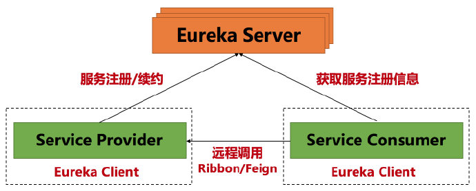
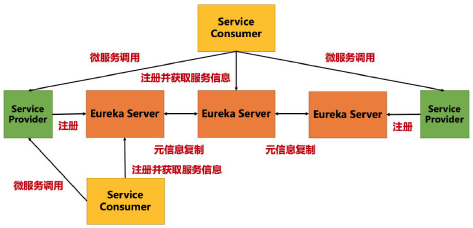

# Eureka

## Eureka 的介绍

### 核心功能

- Service Registry（服务注册）

- Service Discovery（服务发现）

### 基本架构

#### Erueka 由三个角色组成：

- Eureka Server，提供服务注册与发现

- Service Provider，服务提供方，将自身服务注册到 Eureka Server 上，从而让 Eureka Server 持有服务的元信息，让其他的服务消费方能够找到当前服务

- Service Consumer，服务消费方，从 Eureka Server 上获取注册服务列表，从而能够消费服务

- Service Provider/Consumer，相对于 Server，都叫做 Eureka Client

#### Erueka 的基本架构如下图所示

## Eureka Server 的高可用

### 问题说明

单节点的 **Eureka Server** 虽然能够实现基础功能，但是存在单点故障的问题，不能实现高可用。因为 **Eureka Server** 中存储了整个系统中所有的微服务的元数据信息，单节点一旦挂了，所有的服务信息都会丢失，造成整个系统的瘫痪。

### 解决办法

搭建 **Eureka Server** 集群，让各个 **Server** 节点之间互相注册，从而实现微服务元数据的复制/备份，即使单个节点失效，其他的 **Server** 仍可以继续提供服务

### Eureka Server 集群架构如下图所示

## 结尾

- Eureka Server 维护了系统中服务的元信息，这些元信息包含什么你知道吗 ？

- 元信息又是怎么存储的呢 ？

以上两个问题，各位可以先考虑一下，关于问题解答，参考下一篇博文 [Eureka Server 和 Client 之间的信息维护（注册和续约）](Eureka_Server_和_Client_之间的信息维护（注册和续约）.md)

- [Eureka 官方 wiki](https://github.com/Netflix/eureka/wiki) 提到

Eureka 2.0 (Discontinued)

The existing open source work on eureka 2.0 is discontinued. The code base and artifacts that were released as part of the existing repository of work on the 2.x branch is considered use at your own risk.

Eureka 1.x is a core part of Netflix's service discovery system and is still an active project.

关于Eureka 2.0 开源工作已经停止，网络上还是有一些争议的，在下就不在此抱怨了。

对于使用 Eureka 1.x 的，可以看一下这篇文章 [Eureka 2.0 开源流产，真的对你影响很大吗？](http://blog.didispace.com/Eureka-2-0-discontinued/)

## 感谢

[张勤一 - 百度 · 高级Java工程师](https://www.zhihu.com/people/zhang-qin-yi-51-72/activities)
