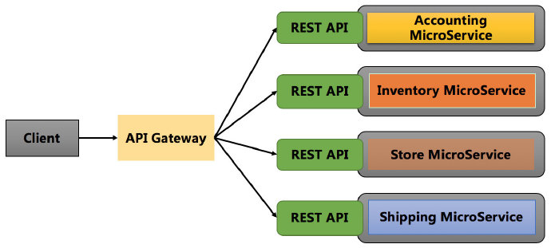
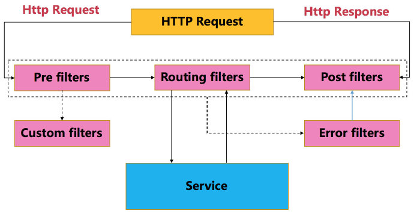

# Zuul

## Zuul 的介绍

在介绍 **Zuul** 可以提供的功能之前，请各位先考虑一个问题：
微服务系统中往往包含很多个功能不同的子系统或微服务，那么，外部应用怎样去访问各种各样的微服务呢？这也是 **Zuul** 所要解决的一个主要问题。

在微服务架构中，后端服务往往不直接开放给调用端，而是通过一个服务网关根据请求的 **url**，路由到相应的服务，即实现请求转发，效果如下图所示。



**Zuul** 提供了服务网关的功能，可以实现负载均衡、反向代理、动态路由、请求转发等功能。**Zuul** 大部分功能都是通过过滤器实现的，**Zuul** 中定义了四种标准的过滤器类型，同时，还支持自定义过滤器（例如，用来记录访问延迟）。
这些过滤器的类型也对应于请求的典型生命周期，如下图所示。



- Pre：在被请求路由之前调用
- Route：在请求路由时调用
- Post：在请求路由最后（Route 和 Error 过滤器之后）调用
- Error：处理请求，发生错误时被调用


## 构造应用的 pom.xml 文件及注释信息
```xml
<?xml version="1.0" encoding="UTF-8"?>
<project xmlns="http://maven.apache.org/POM/4.0.0"
         xmlns:xsi="http://www.w3.org/2001/XMLSchema-instance"
         xsi:schemaLocation="http://maven.apache.org/POM/4.0.0 http://maven.apache.org/xsd/maven-4.0.0.xsd">

    <!-- 指定父pom, 在父pom中配置子模块的公共依赖 -->
    <parent>
        <artifactId>hackfun-ad</artifactId>
        <groupId>com.hackfun.ad</groupId>
        <version>1.0-SNAPSHOT</version>
    </parent>

    <modelVersion>4.0.0</modelVersion>

    <!-- 当前项目/模块的坐标, groupId从父模块中继承 -->
    <artifactId>ad-gateway</artifactId>
    <version>1.0-SNAPSHOT</version>
    <packaging>jar</packaging>

    <!-- 模块名及描述信息 -->
    <name>ad-gateway</name>
    <description>ad-gateway</description>

    <dependencies>
        <!--
            Eureka 客户端, 客户端向 Eureka Server 注册的时候会提供一系列的元数据信息, 例如: 主机, 端口, 健康检查url等
            Eureka Server 接受每个客户端发送的心跳信息, 如果在某个配置的超时时间内未接收到心跳信息, 实例会被从注册列表中移除
        -->
        <dependency>
            <groupId>org.springframework.cloud</groupId>
            <artifactId>spring-cloud-starter-netflix-eureka-client</artifactId>
        </dependency>
        <!-- 服务网关 -->
        <dependency>
            <groupId>org.springframework.cloud</groupId>
            <artifactId>spring-cloud-starter-netflix-zuul</artifactId>
        </dependency>
    </dependencies>

    <!--
        SpringBoot的Maven插件, 能够以Maven的方式为应用提供SpringBoot的支持，可以将
        SpringBoot应用打包为可执行的jar或war文件, 然后以通常的方式运行SpringBoot应用
     -->
    <build>
        <plugins>
            <plugin>
                <groupId>org.springframework.boot</groupId>
                <artifactId>spring-boot-maven-plugin</artifactId>
            </plugin>
        </plugins>
    </build>

</project>
```

## 结尾

- Zuul 的功能大部分都是由过滤器实现的，你还可以定义怎样的过滤器实现你想要的功能呢 ？

- 如果要给我们的系统接入用户模块（用户和权限），放在网关里面做合适吗 ？

以上两个问题，各位可以先考虑一下，关于问题解答，参考下一篇博文 Pending


## 感谢

[张勤一 - 百度 · 高级Java工程师](https://www.zhihu.com/people/zhang-qin-yi-51-72/activities)
