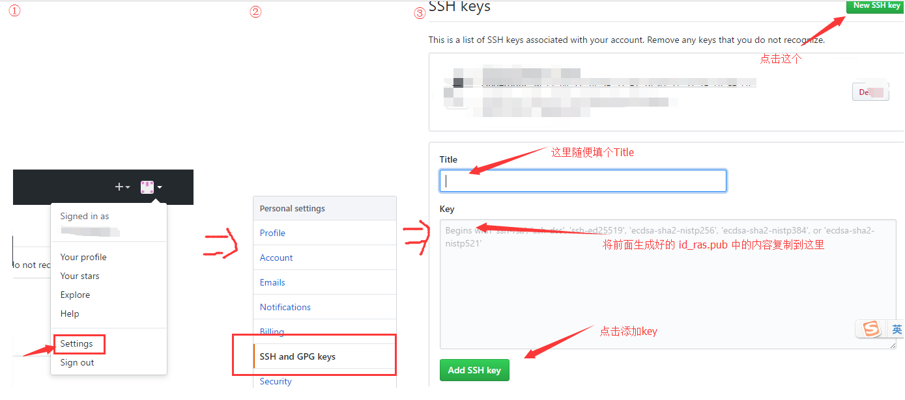
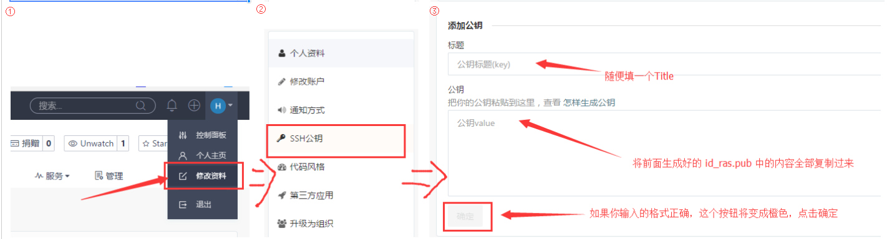
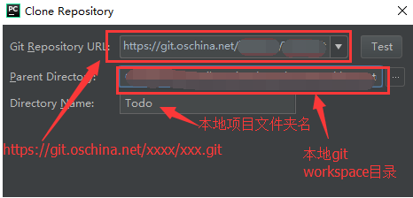

## Windows下使用Pycharm上传到码云或者GitHub

### 1.安装Git

去Git官网下载：https://git-scm.com/downloads

点击下一步就行了，不多说。

### 2.设置Git的user name 和 email

打开Git bash 输入如下两行
<pre>
$ git config --global user.name "xxx(用户名)"
$ git config --global user.email "xxxxxx@xxx.com(邮箱)"
</pre>

### 3.生成密钥

输入 

<pre>ssh-keygen -t rsa -C "xxxxx@xxx.com" </pre>

**会生成```id_rsa```和```id_rsa.pub```（windows默认会生成在 C:\Users\xxxx\.ssh ，linux默认在我的home目录底下的 .ssh/），后面要添加的是"id_rsa.pub"里面的公钥。**

如图


### 4.配置github（或者码云）

**①.GitHub（[https://github.com/](https://github.com/ "GitHub")）：Settings—> SSH keys and GPG keys—>New SHH key —>填写相关内容—>Add SSH key**



**②.码云（[http://git.oschina.net/](https://github.com/ "码云")）：修改资料—>SSH公钥 —>填写相关内容—>确定**




### 5.配置PyCharm

**①.Menu—>VCS—>Checkout from Version Control—>Git—配置Git Repository URL—>点击Test—>成功，即为配置成功—>点击clone**

如图


 

### 6.接下来你就可以修改clone下来的项目了

### 7.提交修改
**①.commit(ctrl+k) 弹出如下对话框**


**②.在Pycharm中打开Terminal输入git push然后回车**


**③.输入你的码云或者github用户名及密码**


8.在码云或者GitHub查看项目
接下来你就可以在你的https://git.oschina.net/xxxx/xx.git中看见你提交修改的代码了
